# MEMORY BANK ANALYZE MODE

Your role is to perform structured analysis, research, and documentation before planning phase. Focus on understanding the problem space through systematic investigation.

```mermaid
graph TD
    Start["🚀 START ANALYZE MODE"] --> ReadTasks["📚 Read tasks.md &<br>.github/copilot-instructions.md"]

    %% Initialization
    ReadTasks --> DetectType["🔍 Detect Document Type<br>from User Input"]
    DetectType --> LoadTemplate["📋 Load Appropriate<br>Template Rule"]

    %% Document Type Detection
    DetectType --> TypeCheck{"📝 Document<br>Type?"}
    TypeCheck -->|"Bug Keywords"| BugAnalysis["🐛 BUG ANALYSIS<br>Load: analyze-template-bugs.instructions.md"]
    TypeCheck -->|"Requirements Keywords"| RequirementsAnalysis["📋 REQUIREMENTS/PRD<br>Load: analyze-template-requirements.instructions.md"]
    TypeCheck -->|"Research Keywords"| ResearchAnalysis["🔍 RESEARCH<br>Load: analyze-template-research.instructions.md"]
    TypeCheck -->|"Brainstorm Keywords"| BrainstormAnalysis["💡 BRAINSTORMING<br>Load: analyze-template-brainstorming.instructions.md"]
    TypeCheck -->|"Unclear"| ClarifyType["❓ Present Type Menu<br>to User"]

    %% 4-Phase Analysis Workflow
    BugAnalysis & RequirementsAnalysis & ResearchAnalysis & BrainstormAnalysis & ClarifyType --> Discover["🔍 DISCOVER PHASE<br>Research & Context Gathering"]

    Discover --> Analyze["📊 ANALYZE PHASE<br>Break Down & Investigate"]
    Analyze --> Synthesize["💡 SYNTHESIZE PHASE<br>Connect & Brainstorm Solutions"]
    Synthesize --> Document["📝 DOCUMENT PHASE<br>Create Analysis Documentation"]

    %% Analytics Folder Organization
    Document --> SaveAnalytics["💾 Save to Analytics Folder<br>memory-bank/analytics/[type]/"]
    SaveAnalytics --> UpdateMemoryBank["📝 Update Memory Bank Files<br>tasks.md, progress.md, activeContext.md"]

    %% Completion & Transition
    UpdateMemoryBank --> VerifyComplete["✅ Verify Analysis<br>Complete"]
    VerifyComplete --> UpdateTasks["📝 Update tasks.md<br>with Status"]
    UpdateTasks --> Transition["⏭️ NEXT MODE:<br>PLAN MODE"]

    %% Template Loading Details
    BugAnalysis -.-> BugTemplate["🐛 BUG ANALYSIS TEMPLATE:<br>- Problem Overview<br>- Reproduction Steps<br>- Root Cause Analysis<br>- Solution Options<br>- Prevention Measures"]

    RequirementsAnalysis -.-> ReqTemplate["📋 REQUIREMENTS TEMPLATE:<br>- Requirements Gathering<br>- Stakeholder Analysis<br>- Feature Breakdown<br>- PRD Structure<br>- Implementation Recommendations"]

    ResearchAnalysis -.-> ResearchTemplate["🔍 RESEARCH TEMPLATE:<br>- Research Questions<br>- Information Gathering<br>- Competitive Analysis<br>- Market Insights<br>- Strategic Recommendations"]

    BrainstormAnalysis -.-> BrainstormTemplate["💡 BRAINSTORMING TEMPLATE:<br>- Problem Definition<br>- Idea Generation<br>- Concept Evaluation<br>- Solution Prioritization<br>- Next Steps"]

    %% Validation Options
    Start -.-> Validation["🔍 VALIDATION OPTIONS:<br>- Show document type detection<br>- Demonstrate 4-phase workflow<br>- Create analysis documents<br>- Show analytics folder usage<br>- Generate mode transition"]

    %% Styling
    style Start fill:#4da6ff,stroke:#0066cc,color:white
    style ReadTasks fill:#80bfff,stroke:#4da6ff,color:black
    style DetectType fill:#80bfff,stroke:#4da6ff,color:black
    style TypeCheck fill:#d94dbb,stroke:#a3378a,color:white
    style BugAnalysis fill:#ff6b6b,stroke:#e55555,color:white
    style RequirementsAnalysis fill:#4ecdc4,stroke:#45b7aa,color:white
    style ResearchAnalysis fill:#45b7d1,stroke:#3a9bc1,color:white
    style BrainstormAnalysis fill:#f9ca24,stroke:#f0b90b,color:black
    style ClarifyType fill:#a55eea,stroke:#8854d0,color:white
    style Discover fill:#26de81,stroke:#20bf6b,color:white
    style Analyze fill:#fd79a8,stroke:#e84393,color:white
    style Synthesize fill:#fdcb6e,stroke:#e17055,color:black
    style Document fill:#6c5ce7,stroke:#5f3dc4,color:white
    style Transition fill:#00b894,stroke:#00a085,color:white
```



## IMPLEMENTATION STEPS

### Step 1: READ TASKS & MAIN RULE
```
read_file({
  target_file: "memory-bank/tasks.md",
  should_read_entire_file: true
})

read_file({
  target_file: ".github/copilot-instructions.md",
  should_read_entire_file: true
})
```

### Step 2: LOAD ANALYZE MODE MAP
```
read_file({
  target_file: ".github/visual-maps/analyze-mode-map.instructions.md",
  should_read_entire_file: true
})
```

### Step 3: DETECT DOCUMENT TYPE
Analyze user input for keywords to determine analysis type:

**Intent Detection Keywords:**
- **Bug Analysis**: "bug", "issue", "error", "problem", "not working", "broken", "crash", "failure"
- **Requirements/PRD**: "requirement", "feature", "PRD", "specification", "product", "user story", "epic"
- **Research**: "research", "competitor", "market", "investigate", "analysis", "study", "survey"
- **Brainstorming**: "brainstorm", "ideas", "creative", "possibilities", "innovation", "ideation"

### Step 4: LOAD DOCUMENT TYPE-SPECIFIC TEMPLATE
Based on document type determined, load:

#### For Bug Analysis:
```
read_file({
  target_file: ".github/Phases/AnalyzePhase/analyze-template-bugs.instructions.md",
  should_read_entire_file: true
})
```

#### For Requirements/PRD:
```
read_file({
  target_file: ".github/Phases/AnalyzePhase/analyze-template-requirements.instructions.md",
  should_read_entire_file: true
})
```

#### For Research:
```
read_file({
  target_file: ".github/Phases/AnalyzePhase/analyze-template-research.instructions.md",
  should_read_entire_file: true
})
```

#### For Brainstorming:
```
read_file({
  target_file: ".github/Phases/AnalyzePhase/analyze-template-brainstorming.instructions.md",
  should_read_entire_file: true
})
```

### Step 5: PRESENT CLARIFICATION MENU (if type unclear)
```
🔍 ANALYZE MODE: What type of analysis?
1. 🐛 Bug Analysis - Investigate issues, errors, problems
2. 📋 Requirements/PRD - Define features, write specifications
3. 🔍 Research - Market analysis, competitor research
4. 💡 Brainstorming - Ideation, creative exploration
5. 🔄 Mixed Analysis - Combine multiple types

Please select the number corresponding to your analysis type.
```

## ANALYZE WORKFLOW: 4-PHASE APPROACH

Execute the analysis using the structured 4-phase workflow, adapting based on the loaded template:

### Phase 1: DISCOVER 🔍
**Purpose**: Research, gather information, understand context
- Collect relevant information and context
- Identify stakeholders and constraints
- Gather background data and requirements
- Define scope and boundaries

### Phase 2: ANALYZE 📊
**Purpose**: Break down problems, identify patterns, investigate deeply
- Decompose complex problems into components
- Identify root causes and patterns
- Analyze relationships and dependencies
- Evaluate current state vs desired state

### Phase 3: SYNTHESIZE 💡
**Purpose**: Connect insights, brainstorm solutions, create connections
- Connect findings from analysis phase
- Generate potential solutions or approaches
- Prioritize options based on criteria
- Create actionable recommendations

### Phase 4: DOCUMENT 📝
**Purpose**: Create structured documentation for handoff to PLAN mode
- Create final analysis document
- Structure findings for easy consumption
- Include clear next steps and recommendations
- Save to appropriate analytics subfolder

## ANALYTICS FOLDER ORGANIZATION

Save analysis documents to the appropriate subfolder:

```
memory-bank/analytics/
├── requirements/     # PRDs, requirement analysis, user stories
├── research/        # Market research, competitor analysis, studies
├── bugs/           # Bug analysis, root cause investigation, incident reports
└── brainstorming/  # Ideation sessions, concept exploration, creative work
```

**File Naming Convention**: `analytics-[type]-[brief-description].md`

Example: `analytics-requirements-user-authentication-system.md`

## COMPLETION CRITERIA

Before transitioning to PLAN mode, verify:

```mermaid
graph TD
    Check["✅ COMPLETION VERIFICATION"] --> C1["Analysis document created<br>in appropriate analytics folder?"]
    Check --> C2["All 4 phases completed<br>(DISCOVER → ANALYZE → SYNTHESIZE → DOCUMENT)?"]
    Check --> C3["Memory Bank files updated<br>(tasks.md, progress.md, activeContext.md)?"]
    Check --> C3["Clear next steps identified<br>for PLAN mode?"]
    Check --> C4["Key insights documented<br>and actionable?"]

    C1 & C2 & C3 & C4 --> Decision{"All Criteria<br>Met?"}
    Decision -->|"Yes"| Complete["✅ Ready for PLAN Mode"]
    Decision -->|"No"| Continue["❌ Continue Analysis Work"]

    style Check fill:#4dbbbb,stroke:#368787,color:white
    style Decision fill:#ffa64d,stroke:#cc7a30,color:white
    style Complete fill:#5fd94d,stroke:#3da336,color:white
    style Continue fill:#ff5555,stroke:#cc0000,color:white
```



## VERIFICATION CHECKLIST

```
✓ ANALYZE MODE COMPLETION CHECKLIST
- Document type correctly identified? [YES/NO]
- Appropriate template loaded and followed? [YES/NO]
- All 4 phases completed (DISCOVER → ANALYZE → SYNTHESIZE → DOCUMENT)? [YES/NO]
- Analysis document saved to correct analytics subfolder? [YES/NO]
- File naming convention followed? [YES/NO]
- Clear next steps provided for PLAN mode? [YES/NO]
- Key insights documented and actionable? [YES/NO]
- Memory Bank files updated (tasks.md, progress.md)? [YES/NO]

→ If all YES: Analysis complete - ready for PLAN mode
→ If any NO: Complete missing analysis elements
```

## MODE TRANSITION

When analysis is complete, update Memory Bank and transition:

1. **Update tasks.md**: Mark analysis phase complete, add link to analysis document
2. **Update progress.md**: Document analysis completion and key findings
3. **Update activeContext.md**: Prepare context for PLAN mode
4. **Recommend PLAN mode**: Provide clear handoff with analysis results

**Transition Message**:
```
## ANALYZE MODE COMPLETE ✅

📋 Analysis Type: [Type]
📄 Document Created: memory-bank/analytics/[subfolder]/[filename]
🔍 Key Findings: [Brief summary]
⏭️ Next Steps: Ready for PLAN mode with analysis foundation

→ RECOMMENDED NEXT MODE: PLAN MODE
```
