# ANALYZE MODE: BRAINSTORMING TEMPLATE

> **TL;DR:** This template provides a structured approach for brainstorming, ideation, and creative exploration through the 4-phase ANALYZE workflow (DISCOVER → ANALYZE → SYNTHESIZE → DOCUMENT).

## 💡 BRAINSTORMING ANALYSIS WORKFLOW

```mermaid
graph TD
    Start["💡 BRAINSTORMING<br>TEMPLATE LOADED"] --> Discover["🔍 DISCOVER PHASE<br>Problem Definition"]
    
    Discover --> D1["🎯 Challenge Definition<br>- Problem statement<br>- Success criteria<br>- Constraints"]
    D1 --> D2["🧠 Context Gathering<br>- Background research<br>- Stakeholder input<br>- Current solutions"]
    D2 --> D3["🎨 Creative Framework<br>- Ideation methods<br>- Evaluation criteria<br>- Session structure"]
    
    D3 --> Analyze["📊 ANALYZE PHASE<br>Idea Generation & Exploration"]
    
    Analyze --> A1["💭 Idea Generation<br>- Divergent thinking<br>- Multiple techniques<br>- Quantity focus"]
    A1 --> A2["🔍 Idea Exploration<br>- Concept development<br>- Feasibility check<br>- Initial evaluation"]
    A2 --> A3["📋 Idea Categorization<br>- Theme grouping<br>- Priority sorting<br>- Pattern identification"]
    
    A3 --> Synthesize["💡 SYNTHESIZE PHASE<br>Concept Development"]
    
    Synthesize --> S1["⭐ Concept Selection<br>- Evaluation matrix<br>- Criteria scoring<br>- Top concepts"]
    S1 --> S2["🏗️ Concept Development<br>- Detailed concepts<br>- Implementation approach<br>- Resource requirements"]
    S2 --> S3["🎯 Recommendation<br>- Preferred concept<br>- Implementation plan<br>- Next steps"]
    
    S3 --> Document["📝 DOCUMENT PHASE<br>Brainstorming Report"]
    
    Document --> Final["💾 Save to<br>memory-bank/analytics/brainstorming/"]
    
    style Start fill:#f9ca24,stroke:#f0b90b,color:black
    style Discover fill:#26de81,stroke:#20bf6b,color:white
    style Analyze fill:#fd79a8,stroke:#e84393,color:white
    style Synthesize fill:#fdcb6e,stroke:#e17055,color:black
    style Document fill:#6c5ce7,stroke:#5f3dc4,color:white
    style Final fill:#00b894,stroke:#00a085,color:white
```



## 📋 TEMPLATE STRUCTURE

### 🔍 DISCOVER PHASE TEMPLATE

```markdown
# BRAINSTORMING SESSION: [Challenge/Topic Name]

## 🔍 DISCOVER PHASE

### Challenge Definition
- **Primary Challenge**: [Main problem or opportunity to explore]
- **Challenge Statement**: [How might we... format]
- **Success Criteria**: [What would a successful solution look like?]
- **Scope**: [What's included/excluded from this brainstorming]
- **Timeline**: [When do we need solutions?]

### Background Context
#### Problem Context
- **Current Situation**: [What's happening now?]
- **Pain Points**: [What specific problems exist?]
- **Root Causes**: [Why do these problems exist?]
- **Impact**: [What's the cost of not solving this?]

#### Stakeholder Context
- **Primary Stakeholders**: [Who is most affected?]
- **Secondary Stakeholders**: [Who else is involved?]
- **Stakeholder Needs**: [What do different groups need?]
- **Constraints from Stakeholders**: [What limitations do they impose?]

#### Environmental Context
- **Market Context**: [Market conditions affecting solutions]
- **Technical Context**: [Technology constraints and opportunities]
- **Resource Context**: [Available resources and limitations]
- **Regulatory Context**: [Legal or compliance considerations]

### Existing Solutions Analysis
#### Current Solutions
1. **Solution 1**: [Existing approach]
   - **How it works**: [Description]
   - **Strengths**: [What works well]
   - **Weaknesses**: [What doesn't work]
   - **Lessons learned**: [Key insights]

2. **Solution 2**: [Existing approach]
   - **How it works**: [Description]
   - **Strengths**: [What works well]
   - **Weaknesses**: [What doesn't work]
   - **Lessons learned**: [Key insights]

#### Competitive Solutions
- **Competitor A**: [How they solve this problem]
- **Competitor B**: [How they solve this problem]
- **Best Practices**: [Industry best practices]
- **Innovation Opportunities**: [Gaps in current solutions]

### Creative Framework Setup
#### Brainstorming Objectives
- **Primary Objective**: [Main goal of brainstorming]
- **Secondary Objectives**: [Additional goals]
- **Innovation Level**: [Incremental/Breakthrough/Disruptive]
- **Risk Tolerance**: [Conservative/Moderate/Aggressive]

#### Ideation Methods to Use
- [ ] **Classic Brainstorming**: Free-flowing idea generation
- [ ] **Mind Mapping**: Visual idea exploration
- [ ] **SCAMPER**: Substitute, Combine, Adapt, Modify, Put to other use, Eliminate, Reverse
- [ ] **Six Thinking Hats**: Different perspective exploration
- [ ] **Worst Possible Idea**: Reverse brainstorming
- [ ] **Brainwriting**: Silent idea generation
- [ ] **Storyboarding**: Visual scenario creation
- [ ] **Role Playing**: Perspective-taking ideation

#### Evaluation Criteria
1. **Feasibility**: [How realistic is implementation?]
2. **Impact**: [How much value would this create?]
3. **Innovation**: [How novel/creative is this?]
4. **Resources**: [What resources would this require?]
5. **Timeline**: [How quickly could this be implemented?]
6. **Risk**: [What are the potential risks?]
```

### 📊 ANALYZE PHASE TEMPLATE

```markdown
## 📊 ANALYZE PHASE

### Idea Generation Session

#### Session 1: [Method Name - e.g., Classic Brainstorming]
**Method**: [Description of method used]
**Duration**: [Time spent]
**Participants**: [Who participated]

**Generated Ideas**:
1. [Idea 1 - brief description]
2. [Idea 2 - brief description]
3. [Idea 3 - brief description]
4. [Continue listing all ideas...]

#### Session 2: [Method Name - e.g., SCAMPER]
**Method**: [Description of method used]
**Duration**: [Time spent]
**Focus**: [Specific aspect explored]

**Generated Ideas**:
1. [Idea 1 - brief description]
2. [Idea 2 - brief description]
3. [Idea 3 - brief description]
4. [Continue listing all ideas...]

#### Session 3: [Method Name - e.g., Mind Mapping]
**Method**: [Description of method used]
**Central Theme**: [Main theme explored]
**Branches**: [Key branches explored]

**Generated Ideas**:
1. [Idea 1 - brief description]
2. [Idea 2 - brief description]
3. [Idea 3 - brief description]
4. [Continue listing all ideas...]

### Idea Exploration & Development

#### High-Potential Ideas (Initial Assessment)
1. **Idea Name**: [Descriptive name]
   - **Description**: [Detailed description]
   - **How it works**: [Mechanism/process]
   - **Key benefits**: [Main advantages]
   - **Initial feasibility**: [High/Medium/Low]
   - **Potential challenges**: [Obstacles to consider]

2. **Idea Name**: [Descriptive name]
   - **Description**: [Detailed description]
   - **How it works**: [Mechanism/process]
   - **Key benefits**: [Main advantages]
   - **Initial feasibility**: [High/Medium/Low]
   - **Potential challenges**: [Obstacles to consider]

[Continue for top 5-10 ideas]

### Idea Categorization & Patterns

#### Thematic Categories
**Category 1: [Theme Name]**
- [Idea 1]
- [Idea 2]
- [Idea 3]
- **Pattern**: [Common thread across these ideas]

**Category 2: [Theme Name]**
- [Idea 1]
- [Idea 2]
- [Idea 3]
- **Pattern**: [Common thread across these ideas]

**Category 3: [Theme Name]**
- [Idea 1]
- [Idea 2]
- [Idea 3]
- **Pattern**: [Common thread across these ideas]

#### Implementation Complexity Categories
**Quick Wins (Low complexity, High impact)**
- [Idea 1]
- [Idea 2]
- [Idea 3]

**Strategic Projects (Medium complexity, High impact)**
- [Idea 1]
- [Idea 2]
- [Idea 3]

**Moonshots (High complexity, Potentially transformative)**
- [Idea 1]
- [Idea 2]
- [Idea 3]

#### Innovation Level Categories
**Incremental Improvements**
- [Ideas that improve existing solutions]

**Breakthrough Innovations**
- [Ideas that create new approaches]

**Disruptive Concepts**
- [Ideas that could change the game entirely]

### Initial Idea Evaluation

#### Evaluation Matrix
| Idea | Feasibility | Impact | Innovation | Resources | Timeline | Risk | Total Score |
|------|-------------|--------|------------|-----------|----------|------|-------------|
| [Idea 1] | [1-5] | [1-5] | [1-5] | [1-5] | [1-5] | [1-5] | [Sum] |
| [Idea 2] | [1-5] | [1-5] | [1-5] | [1-5] | [1-5] | [1-5] | [Sum] |
| [Idea 3] | [1-5] | [1-5] | [1-5] | [1-5] | [1-5] | [1-5] | [Sum] |

*Scoring: 1=Low, 2=Below Average, 3=Average, 4=Above Average, 5=High*

#### Top-Scoring Ideas
1. **[Idea Name]** (Score: [X]/30)
2. **[Idea Name]** (Score: [X]/30)
3. **[Idea Name]** (Score: [X]/30)
4. **[Idea Name]** (Score: [X]/30)
5. **[Idea Name]** (Score: [X]/30)
```

### 💡 SYNTHESIZE PHASE TEMPLATE

```markdown
## 💡 SYNTHESIZE PHASE

### Concept Selection & Development

#### Top 3 Concepts for Development

##### Concept 1: [Concept Name]
**Core Idea**: [Central concept in one sentence]

**Detailed Description**:
[Comprehensive description of the concept, how it works, and what makes it unique]

**Value Proposition**:
- **User Value**: [How this benefits users]
- **Business Value**: [How this benefits the business]
- **Competitive Advantage**: [What makes this better than alternatives]

**Implementation Approach**:
- **Phase 1**: [Initial implementation steps]
- **Phase 2**: [Expansion/enhancement steps]
- **Phase 3**: [Full realization steps]

**Resource Requirements**:
- **Team**: [People needed]
- **Technology**: [Technical requirements]
- **Budget**: [Estimated costs]
- **Timeline**: [Implementation timeline]

**Risk Assessment**:
- **Technical Risks**: [Technology-related risks]
- **Market Risks**: [Market acceptance risks]
- **Resource Risks**: [Resource availability risks]
- **Mitigation Strategies**: [How to address risks]

##### Concept 2: [Concept Name]
[Follow same structure as Concept 1]

##### Concept 3: [Concept Name]
[Follow same structure as Concept 1]

### Concept Comparison & Selection

#### Comparative Analysis
| Criteria | Concept 1 | Concept 2 | Concept 3 |
|----------|-----------|-----------|-----------|
| **User Impact** | [Assessment] | [Assessment] | [Assessment] |
| **Business Value** | [Assessment] | [Assessment] | [Assessment] |
| **Technical Feasibility** | [Assessment] | [Assessment] | [Assessment] |
| **Resource Requirements** | [Assessment] | [Assessment] | [Assessment] |
| **Time to Market** | [Assessment] | [Assessment] | [Assessment] |
| **Innovation Level** | [Assessment] | [Assessment] | [Assessment] |
| **Risk Level** | [Assessment] | [Assessment] | [Assessment] |

#### Decision Matrix
| Concept | Weighted Score | Pros | Cons | Recommendation |
|---------|----------------|------|------|----------------|
| Concept 1 | [Score] | [Key advantages] | [Key disadvantages] | [Recommend/Consider/Reject] |
| Concept 2 | [Score] | [Key advantages] | [Key disadvantages] | [Recommend/Consider/Reject] |
| Concept 3 | [Score] | [Key advantages] | [Key disadvantages] | [Recommend/Consider/Reject] |

### Recommended Solution

#### Primary Recommendation: [Concept Name]
**Rationale**: [Why this concept was selected]

**Implementation Strategy**:
1. **Immediate Next Steps** (0-30 days)
   - [Action 1]
   - [Action 2]
   - [Action 3]

2. **Short-term Milestones** (1-3 months)
   - [Milestone 1]
   - [Milestone 2]
   - [Milestone 3]

3. **Long-term Vision** (3+ months)
   - [Vision element 1]
   - [Vision element 2]
   - [Vision element 3]

**Success Metrics**:
- **Quantitative Metrics**: [Measurable outcomes]
- **Qualitative Metrics**: [Qualitative indicators]
- **Timeline Metrics**: [Time-based milestones]

#### Alternative Recommendations
**Secondary Option**: [Concept Name]
- **When to consider**: [Circumstances for this option]
- **Key differences**: [How it differs from primary]

**Backup Option**: [Concept Name]
- **When to consider**: [Circumstances for this option]
- **Key differences**: [How it differs from primary]

### Innovation Portfolio Approach
**Quick Wins** (Implement immediately):
- [Idea 1]
- [Idea 2]

**Strategic Bets** (Plan for implementation):
- [Concept 1]
- [Concept 2]

**Future Exploration** (Keep for later consideration):
- [Concept 1]
- [Concept 2]
```

### 📝 DOCUMENT PHASE TEMPLATE

```markdown
## 📝 DOCUMENT PHASE

### Executive Summary
- **Challenge**: [Problem/opportunity explored]
- **Process**: [Brainstorming approach used]
- **Key Insight**: [Most important discovery]
- **Recommended Solution**: [Primary recommendation]
- **Expected Impact**: [Anticipated outcomes]
- **Next Steps**: [Immediate actions needed]

### Brainstorming Process Overview
- **Methods Used**: [List of ideation techniques]
- **Duration**: [Total time invested]
- **Participants**: [Who was involved]
- **Ideas Generated**: [Total number of ideas]
- **Concepts Developed**: [Number of detailed concepts]

### Key Insights & Discoveries
#### Process Insights
- [What we learned about the problem]
- [What we learned about potential solutions]
- [What we learned about constraints and opportunities]

#### Solution Insights
- [Key themes that emerged]
- [Unexpected solution directions]
- [Patterns in successful concepts]

### Recommended Solution Summary
**Solution**: [Name and brief description]

**Why This Solution**:
- [Reason 1]
- [Reason 2]
- [Reason 3]

**Implementation Overview**:
- **Phase 1**: [Timeline and scope]
- **Phase 2**: [Timeline and scope]
- **Phase 3**: [Timeline and scope]

**Resource Requirements**:
- **Team**: [People needed]
- **Budget**: [Estimated investment]
- **Timeline**: [Overall timeline]

**Expected Outcomes**:
- **Short-term**: [0-6 months]
- **Medium-term**: [6-18 months]
- **Long-term**: [18+ months]

### Alternative Solutions
1. **Alternative 1**: [Name and brief description]
   - **When to consider**: [Circumstances]
   - **Key benefits**: [Main advantages]

2. **Alternative 2**: [Name and brief description]
   - **When to consider**: [Circumstances]
   - **Key benefits**: [Main advantages]

### Implementation Roadmap
| Phase | Timeline | Key Activities | Deliverables | Success Criteria |
|-------|----------|----------------|--------------|------------------|
| Phase 1 | [Dates] | [Activities] | [Deliverables] | [Criteria] |
| Phase 2 | [Dates] | [Activities] | [Deliverables] | [Criteria] |
| Phase 3 | [Dates] | [Activities] | [Deliverables] | [Criteria] |

### Risk Assessment & Mitigation
| Risk | Probability | Impact | Mitigation Strategy |
|------|-------------|--------|-------------------|
| [Risk 1] | [High/Med/Low] | [High/Med/Low] | [Strategy] |
| [Risk 2] | [High/Med/Low] | [High/Med/Low] | [Strategy] |
| [Risk 3] | [High/Med/Low] | [High/Med/Low] | [Strategy] |

### Appendix: All Generated Ideas
#### Category 1: [Theme]
- [Idea 1]
- [Idea 2]
- [Idea 3]

#### Category 2: [Theme]
- [Idea 1]
- [Idea 2]
- [Idea 3]

[Continue for all categories]

### Next Steps for PLAN Mode
- **Planning Scope**: [What needs detailed planning]
- **Design Decisions**: [Key design choices to make]
- **Technical Planning**: [Technical aspects to plan]
- **Resource Planning**: [Team and budget planning needed]
- **Timeline Planning**: [Detailed timeline development]
```

## 🔍 GUIDANCE QUESTIONS

Use these questions to guide the brainstorming:

### Discovery Questions
- "What's the real problem we're trying to solve?"
- "Who are we solving this for and what do they really need?"
- "What would success look like?"
- "What constraints do we need to work within?"
- "What assumptions should we challenge?"

### Analysis Questions
- "What if we approached this completely differently?"
- "How might we combine different ideas?"
- "What would the ideal solution look like without constraints?"
- "What are we not considering?"
- "How could we make this 10x better?"

### Synthesis Questions
- "Which ideas have the most potential?"
- "What patterns do we see across the best ideas?"
- "How can we build on the strongest concepts?"
- "What would it take to make this real?"
- "What's the simplest version that would work?"

## ✅ QUALITY STANDARDS

Ensure the brainstorming analysis meets these criteria:

```
✓ BRAINSTORMING ANALYSIS QUALITY CHECKLIST
- Challenge clearly defined with context? [YES/NO]
- Multiple ideation methods used? [YES/NO]
- Sufficient quantity of ideas generated (50+ for major challenges)? [YES/NO]
- Ideas properly categorized and analyzed? [YES/NO]
- Top concepts developed in detail? [YES/NO]
- Evaluation criteria applied consistently? [YES/NO]
- Clear recommendation with rationale? [YES/NO]
- Implementation approach outlined? [YES/NO]
- Risks identified with mitigation strategies? [YES/NO]
- Next steps for PLAN mode clearly outlined? [YES/NO]

→ If all YES: Brainstorming analysis complete and ready for PLAN mode
→ If any NO: Complete missing brainstorming elements
```

## 📁 FILE NAMING & LOCATION

Save the completed brainstorming analysis to:
- **Location**: `memory-bank/analytics/brainstorming/`
- **Filename**: `analytics-brainstorming-[brief-description].md`
- **Example**: `analytics-brainstorming-user-onboarding-improvements.md`

## 🔄 HANDOFF TO PLAN MODE

When brainstorming analysis is complete, provide this handoff information:

```
## BRAINSTORMING ANALYSIS COMPLETE ✅

📋 Challenge: [Challenge explored]
🎯 Key Insight: [Most important discovery]
💡 Recommended Solution: [Primary recommendation]
📄 Brainstorming Document: memory-bank/analytics/brainstorming/analytics-brainstorming-[brief-description].md
⏭️ Planning Scope: [What needs detailed planning]

→ READY FOR PLAN MODE: Solution planning can begin with creative foundation


