# ANALYZE MODE: BUG ANALYSIS TEMPLATE

> **TL;DR:** This template provides a structured approach for investigating bugs, errors, and system issues through the 4-phase ANALYZE workflow (DISCOVER → ANALYZE → SYNTHESIZE → DOCUMENT).

## 🐛 BUG ANALYSIS WORKFLOW

```mermaid
graph TD
    Start["🐛 BUG ANALYSIS<br>TEMPLATE LOADED"] --> Discover["🔍 DISCOVER PHASE<br>Problem Investigation"]
    
    Discover --> D1["📋 Problem Overview<br>- Bug ID/Reference<br>- Severity Level<br>- Affected Systems"]
    D1 --> D2["🔄 Reproduction Steps<br>- Step-by-step process<br>- Environment details<br>- Expected vs Actual"]
    D2 --> D3["📊 Impact Assessment<br>- User impact<br>- Business impact<br>- System impact"]
    
    D3 --> Analyze["📊 ANALYZE PHASE<br>Root Cause Investigation"]
    
    Analyze --> A1["🔍 Root Cause Hypotheses<br>- Multiple potential causes<br>- Evidence for each<br>- Likelihood assessment"]
    A1 --> A2["🧪 Investigation Methods<br>- Log analysis<br>- Code review<br>- System monitoring"]
    A2 --> A3["📈 Pattern Analysis<br>- Frequency patterns<br>- Related incidents<br>- System correlations"]
    
    A3 --> Synthesize["💡 SYNTHESIZE PHASE<br>Solution Development"]
    
    Synthesize --> S1["⚡ Solution Options<br>- Quick fix (immediate)<br>- Proper fix (complete)<br>- Alternative approaches"]
    S1 --> S2["⚖️ Solution Evaluation<br>- Risk assessment<br>- Implementation effort<br>- Long-term impact"]
    S2 --> S3["🎯 Recommendation<br>- Selected solution<br>- Implementation plan<br>- Risk mitigation"]
    
    S3 --> Document["📝 DOCUMENT PHASE<br>Bug Analysis Report"]
    
    Document --> Final["💾 Save to<br>memory-bank/analytics/bugs/"]
    
    style Start fill:#ff6b6b,stroke:#e55555,color:white
    style Discover fill:#26de81,stroke:#20bf6b,color:white
    style Analyze fill:#fd79a8,stroke:#e84393,color:white
    style Synthesize fill:#fdcb6e,stroke:#e17055,color:black
    style Document fill:#6c5ce7,stroke:#5f3dc4,color:white
    style Final fill:#00b894,stroke:#00a085,color:white
```



## 📋 TEMPLATE STRUCTURE

### 🔍 DISCOVER PHASE TEMPLATE

```markdown
# BUG ANALYSIS: [Bug Name/ID]

## 🔍 DISCOVER PHASE

### Problem Overview
- **Bug ID**: [Tracking reference/ticket number]
- **Severity**: [Critical/High/Medium/Low]
- **Priority**: [P0/P1/P2/P3]
- **Affected Systems**: [List of system components]
- **Reporter**: [Who reported the issue]
- **Date Reported**: [When issue was first reported]

### Reproduction Steps
1. [Step 1 - be specific]
2. [Step 2 - include data/inputs]
3. [Step 3 - describe actions]
4. [Continue as needed]

### Environment Details
- **Platform**: [OS, browser, device]
- **Version**: [Software/app version]
- **Configuration**: [Relevant settings]
- **Data State**: [Database/cache state]

### Expected vs Actual Behavior
- **Expected**: [What should happen]
- **Actual**: [What actually happens]
- **Screenshots/Logs**: [Attach evidence]

### Impact Assessment
- **User Impact**: [How users are affected]
- **Business Impact**: [Revenue/reputation effect]
- **System Impact**: [Performance/stability effect]
- **Workaround Available**: [Yes/No - describe if yes]
```

### 📊 ANALYZE PHASE TEMPLATE

```markdown
## 📊 ANALYZE PHASE

### Root Cause Hypotheses
1. **Hypothesis 1**: [Potential cause]
   - **Evidence**: [Supporting evidence]
   - **Likelihood**: [High/Medium/Low]
   - **Investigation Method**: [How to verify]

2. **Hypothesis 2**: [Potential cause]
   - **Evidence**: [Supporting evidence]
   - **Likelihood**: [High/Medium/Low]
   - **Investigation Method**: [How to verify]

3. **Hypothesis 3**: [Additional causes as needed]

### Investigation Results
- **Log Analysis**: [Key findings from logs]
- **Code Review**: [Relevant code sections examined]
- **System Monitoring**: [Performance/resource data]
- **Database Analysis**: [Data integrity/query issues]

### Pattern Analysis
- **Frequency**: [How often does this occur]
- **Timing**: [When does it happen - time patterns]
- **Conditions**: [What conditions trigger it]
- **Related Incidents**: [Similar past issues]
- **System Correlations**: [Other system events]

### Root Cause Determination
- **Primary Cause**: [Main cause identified]
- **Contributing Factors**: [Secondary causes]
- **Evidence Summary**: [Key evidence supporting conclusion]
```

### 💡 SYNTHESIZE PHASE TEMPLATE

```markdown
## 💡 SYNTHESIZE PHASE

### Solution Options

#### Option 1: Quick Fix (Immediate Relief)
- **Description**: [What this solution does]
- **Implementation**: [How to implement]
- **Timeline**: [How long to implement]
- **Pros**: [Benefits of this approach]
- **Cons**: [Limitations/risks]
- **Risk Level**: [Low/Medium/High]

#### Option 2: Proper Fix (Complete Solution)
- **Description**: [What this solution does]
- **Implementation**: [How to implement]
- **Timeline**: [How long to implement]
- **Pros**: [Benefits of this approach]
- **Cons**: [Limitations/risks]
- **Risk Level**: [Low/Medium/High]

#### Option 3: Alternative Approach
- **Description**: [Different approach if applicable]
- **Implementation**: [How to implement]
- **Timeline**: [How long to implement]
- **Pros**: [Benefits of this approach]
- **Cons**: [Limitations/risks]
- **Risk Level**: [Low/Medium/High]

### Solution Evaluation Matrix
| Criteria | Quick Fix | Proper Fix | Alternative |
|----------|-----------|------------|-------------|
| Implementation Speed | [Score] | [Score] | [Score] |
| Long-term Stability | [Score] | [Score] | [Score] |
| Resource Requirements | [Score] | [Score] | [Score] |
| Risk Level | [Score] | [Score] | [Score] |
| **Total Score** | [Sum] | [Sum] | [Sum] |

### Recommended Solution
- **Selected Option**: [Chosen solution]
- **Rationale**: [Why this option was selected]
- **Implementation Plan**: [Step-by-step plan]
- **Risk Mitigation**: [How to minimize risks]
- **Success Criteria**: [How to measure success]
```

### 📝 DOCUMENT PHASE TEMPLATE

```markdown
## 📝 DOCUMENT PHASE

### Executive Summary
- **Issue**: [Brief description of the bug]
- **Impact**: [Summary of impact]
- **Root Cause**: [Primary cause in one sentence]
- **Recommended Action**: [Selected solution in one sentence]
- **Timeline**: [Expected resolution time]

### Implementation Plan
1. **Immediate Actions** (0-24 hours)
   - [Action 1]
   - [Action 2]

2. **Short-term Actions** (1-7 days)
   - [Action 1]
   - [Action 2]

3. **Long-term Actions** (1-4 weeks)
   - [Action 1]
   - [Action 2]

### Prevention Measures
- **Code Changes**: [Preventive code modifications]
- **Process Improvements**: [Process changes to prevent recurrence]
- **Monitoring Enhancements**: [Additional monitoring/alerts]
- **Testing Improvements**: [Test cases to catch similar issues]

### Communication Plan
- **Stakeholders to Notify**: [Who needs to know]
- **Communication Timeline**: [When to communicate]
- **Status Updates**: [How often to provide updates]

### Next Steps for PLAN Mode
- **Planning Requirements**: [What PLAN mode needs to know]
- **Implementation Scope**: [What needs to be planned]
- **Dependencies**: [External dependencies to consider]
- **Resource Requirements**: [Team/tool requirements]
```

## 🔍 GUIDANCE QUESTIONS

Use these questions to guide the investigation:

### Discovery Questions
- "Can you reproduce this bug consistently?"
- "What were you trying to accomplish when this happened?"
- "Has this worked correctly before?"
- "What changed recently in the system?"
- "Are other users experiencing this issue?"

### Analysis Questions
- "What systems could be causing this behavior?"
- "What does the error message tell us?"
- "Are there patterns in when this occurs?"
- "What do the logs show around the time of the error?"
- "Could this be related to recent deployments?"

### Synthesis Questions
- "What's the business impact if this isn't fixed immediately?"
- "What's the simplest solution that would work?"
- "What are the risks of each potential solution?"
- "How can we prevent this from happening again?"
- "What would a permanent fix look like?"

## ✅ QUALITY STANDARDS

Ensure the bug analysis meets these criteria:

```
✓ BUG ANALYSIS QUALITY CHECKLIST
- Root cause clearly identified with evidence? [YES/NO]
- Multiple solution options evaluated? [YES/NO]
- Implementation plan provided with timeline? [YES/NO]
- Prevention measures specified? [YES/NO]
- Impact assessment completed (user/business/system)? [YES/NO]
- Reproduction steps clear and detailed? [YES/NO]
- Risk assessment completed for all solutions? [YES/NO]
- Communication plan defined? [YES/NO]
- Next steps for PLAN mode clearly outlined? [YES/NO]

→ If all YES: Bug analysis complete and ready for PLAN mode
→ If any NO: Complete missing analysis elements
```

## 📁 FILE NAMING & LOCATION

Save the completed bug analysis to:
- **Location**: `memory-bank/analytics/bugs/`
- **Filename**: `analytics-bug-[brief-description].md`
- **Example**: `analytics-bug-user-login-timeout.md`

## 🔄 HANDOFF TO PLAN MODE

When bug analysis is complete, provide this handoff information:

```
## BUG ANALYSIS COMPLETE ✅

📋 Bug: [Bug name/ID]
🎯 Root Cause: [Primary cause]
💡 Recommended Solution: [Selected solution]
📄 Analysis Document: memory-bank/analytics/bugs/analytics-bug-[brief-description].md
⏭️ Planning Scope: [What needs to be planned for implementation]

→ READY FOR PLAN MODE: Implementation planning can begin


