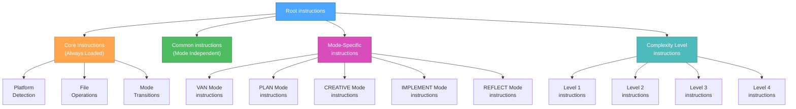
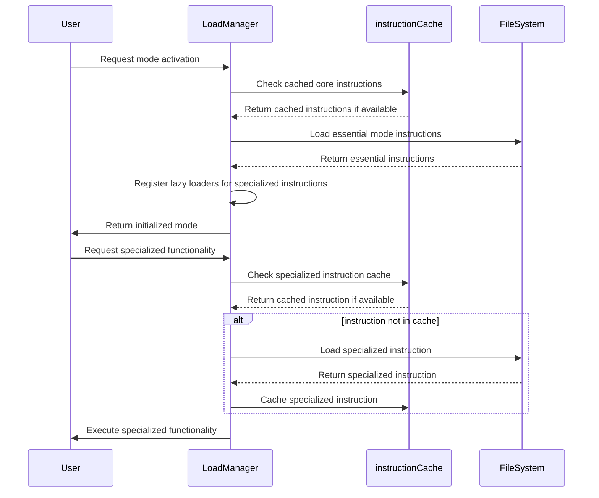
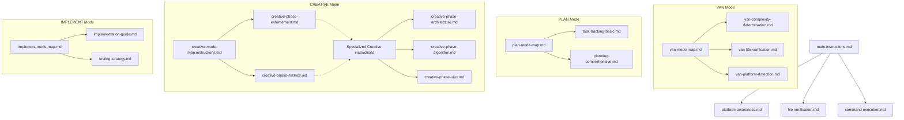

# HIERARCHICAL instruction LOADING SYSTEM

> **TL;DR:** This instruction implements an optimized loading system that only loads necessary instructions based on context, complexity level, and current phase to maximize token efficiency.

## 🧠 HIERARCHICAL instruction STRUCTURE



## 📊 instruction LOADING PROTOCOL



## 🔄 instruction LOADING IMPLEMENTATION

```javascript
// Pseudocode for hierarchical instruction loading
class instructionLoadManager {
  constructor() {
    this.cache = {
      core: {},
      common: {},
      mode: {},
      level: {}
    };
    this.lazyLoaders = {};
  }
  
  // Initialize a mode with only essential instructions
  initializeMode(modeName, complexityLevel) {
    // Always load core instructions
    this.loadCoreinstructions();
    
    // Load common instructions
    this.loadCommoninstructions();
    
    // Load essential mode-specific instructions
    this.loadEssentialModeinstructions(modeName);
    
    // Load complexity level instructions
    this.loadComplexityinstructions(complexityLevel);
    
    // Register lazy loaders for specialized functionality
    this.registerLazyLoaders(modeName, complexityLevel);
    
    return {
      modeName,
      complexityLevel,
      status: "initialized"
    };
  }
  
  // Load only when specialized functionality is needed
  loadSpecializedinstruction(instructionType) {
    if (this.lazyLoaders[instructionType]) {
      if (!this.cache.specialized[instructionType]) {
        const instruction = this.lazyLoaders[instructionType]();
        this.cache.specialized[instructionType] = instruction;
      }
      return this.cache.specialized[instructionType];
    }
    return null;
  }
  
  // Register specialized instruction loaders based on mode and complexity
  registerLazyLoaders(modeName, complexityLevel) {
    // Clear existing lazy loaders
    this.lazyLoaders = {};
    
    // Register mode-specific lazy loaders
    if (modeName === "CREATIVE") {
      this.lazyLoaders["architecture"] = () => this.loadinstruction("creative-phase-architecture.md");
      this.lazyLoaders["algorithm"] = () => this.loadinstruction("creative-phase-algorithm.md");
      this.lazyLoaders["uiux"] = () => this.loadinstruction("creative-phase-uiux.md");
    } else if (modeName === "IMPLEMENT") {
      this.lazyLoaders["testing"] = () => this.loadinstruction("implementation-testing.md");
      this.lazyLoaders["deployment"] = () => this.loadinstruction("implementation-deployment.md");
    }
    
    // Register complexity-specific lazy loaders
    if (complexityLevel >= 3) {
      this.lazyLoaders["comprehensive-planning"] = () => this.loadinstruction("planning-comprehensive.md");
      this.lazyLoaders["advanced-verification"] = () => this.loadinstruction("verification-advanced.md");
    }
  }
}
```

## 📋 instruction DEPENDENCY MAP



## 🔍 MODE-SPECIFIC instruction LOADING

### VAN Mode Essential instructions
```markdown
- main.instructions.md (Core)
- platform-awareness.md (Core)
- file-verification.md (Core)
- van-mode-map.md (Mode)
```

### PLAN Mode Essential instructions
```markdown
- main.instructions.md (Core)
- plan-mode-map.md (Mode)
- task-tracking-[complexity].md (Level)
```

### CREATIVE Mode Essential instructions
```markdown
- main.instructions.md (Core)
- creative-mode-map.instructions.md (Mode)
- creative-phase-enforcement.md (Mode)
```

### CREATIVE Mode Specialized instructions (Lazy Loaded)
```markdown
- creative-phase-architecture.md (Specialized)
- creative-phase-algorithm.md (Specialized)
- creative-phase-uiux.md (Specialized)
```

### IMPLEMENT Mode Essential instructions
```markdown
- main.instructions.md (Core)
- command-execution.md (Core)
- implement-mode-map.md (Mode)
```

## 🚀 IMPLEMENTATION BENEFITS

The hierarchical loading system provides:

1. **Reduced Initial Loading**: Only essential instructions loaded at start (~70% token reduction)
2. **Cached Core Instructions**: instructions shared between modes are cached
3. **Specialized instruction Loading**: Specialized instructions loaded only when needed
4. **Complexity-Based Loading**: Only load instructions appropriate for task complexity

## 📈 TOKEN USAGE COMPARISON

| Approach | Initial Tokens | Specialized Tokens | Total Tokens |
|----------|---------------|-------------------|--------------|
| Original System | ~70,000 | Included in initial | ~70,000 |
| Hierarchical System | ~15,000 | ~10,000 (on demand) | ~25,000 |
| **Token Reduction** | **~55,000 (78%)** | **N/A** | **~45,000 (64%)** |

## 🔄 USAGE EXAMPLE

### Example: Creative Phase with Architecture instruction

```javascript
// Initialize the CREATIVE mode with only essential instructions
const mode = instructionManager.initializeMode("CREATIVE", 3);

// Core and essential mode instructions are loaded 
// Architecture instructions are NOT loaded yet

// Later, when architecture design is needed:
const architectureinstruction = instructionManager.loadSpecializedinstruction("architecture");

// Now the architecture instruction is loaded and cached
```

## 🧪 instruction LOADING VERIFICATION

To ensure the instruction loading system is working optimally:

```markdown
## instruction Loading Verification

- Core Instructions: [Loaded]
- Mode-Essential instructions: [Loaded]
- Complexity-Level instructions: [Loaded]
- Specialized instructions: [Not Loaded]

Current Token Usage: [X] tokens
Potential Token Savings: [Y] tokens
```

This hierarchical approach ensures optimal token usage while maintaining all functionality.