# OPTIMIZED FILE VERIFICATION SYSTEM

🚨 CRITICAL: MEMORY BANK VERIFICATION REQUIRED 🚨
Memory Bank structure MUST exist before any file operations
This check MUST be executed first in all verification processes

> **TL;DR:** This system provides a structured approach to verify file structure integrity before task implementation, with emphasis on efficient checks and clear status reporting.

## 🔍 FILE VERIFICATION WORKFLOW

```mermaid
graph TD
    %% Critical Memory Bank verification - MUST be first
    Start["Start File Verification"] --> MemBankCheck{"Memory Bank<br>Exists?"}
    MemBankCheck -->|"No"| CreateMemBank["CREATE MEMORY BANK<br>[CRITICAL]"]
    MemBankCheck -->|"Yes"| VerifyMemBankComplete["Verify Memory Bank<br>Structure Complete"]
    CreateMemBank --> VerifyMemBankComplete
    
    VerifyMemBankComplete --> PassCheck{"All Critical<br>Checks Pass?"}
    PassCheck -->|"No"| AbortAll["⛔ ABORT ALL OPERATIONS<br>Fix Memory Bank First"]
    PassCheck -->|"Yes"| MainVerification

    %% Regular verification flow continues here
    MainVerification["Start Full<br>File Verification"] --> BatchVerify["Batch Verification<br>Using Patterns"]
    BatchVerify --> BrokenLinks["Check for<br>Broken References"]
    BrokenLinks --> DirectoryStructure["Verify Directory<br>Structure"]
    DirectoryStructure --> Status{"All Verifications<br>Successful?"}
    
    Status -->|"Yes"| Complete["Verification<br>Complete ✓"]
    Status -->|"No"| Diagnose["Diagnose<br>Issues"]
    Diagnose --> Attempt{"Attempt Auto<br>Resolution?"}
    
    Attempt -->|"Yes"| AutoFix["Auto-Fix<br>Issues"]
    Attempt -->|"No"| ReportIssue["Report Issues to<br>User"]
    
    AutoFix --> Recheck{"Issues<br>Resolved?"}
    Recheck -->|"Yes"| ReportSuccess["Report Success<br>to User"]
    Recheck -->|"No"| ReportIssue
    
    ReportSuccess --> Complete
    ReportIssue --> UserAction["Wait for<br>User Action"]
    UserAction --> ReVerify["Re-Verify<br>After User Action"]
    ReVerify --> Status
    
    style MemBankCheck fill:#ff0000,stroke:#990000,color:white,stroke-width:3px
    style CreateMemBank fill:#ff0000,stroke:#990000,color:white,stroke-width:3px
    style VerifyMemBankComplete fill:#ff0000,stroke:#990000,color:white,stroke-width:3px
    style PassCheck fill:#ff0000,stroke:#990000,color:white,stroke-width:3px
    style AbortAll fill:#ff0000,stroke:#990000,color:white,stroke-width:3px
    style Status fill:#f6546a,stroke:#c30052,color:white
    style Complete fill:#10b981,stroke:#059669,color:white
```



## 🧩 MEMORY BANK VERIFICATION - CRITICAL COMPONENT

**CRITICAL:** All paths MUST match `memory-bank-paths.instructions.md` structure.

Memory Bank verification MUST be executed first in any file verification process:

```javascript
function verifyMemoryBank() {
  // Check if Memory Bank exists at project root
  const memoryBankExists = checkDirectoryExists("memory-bank");
  if (!memoryBankExists) {
    console.error("⛔ CRITICAL ERROR: Memory Bank does not exist at project root");
    createMemoryBankStructure();
    return verifyMemoryBankCreation();
  }
  
  // Check required subdirectories per memory-bank-paths.instructions.md
  const requiredDirs = [
    "memory-bank/creative",
    "memory-bank/reflection",
    "memory-bank/archive"
  ];
  
  const missingDirs = requiredDirs.filter(dir => !checkDirectoryExists(dir));
  if (missingDirs.length > 0) {
    console.error(`⛔ CRITICAL ERROR: Missing Memory Bank directories: ${missingDirs.join(", ")}`);
    createMissingDirectories(missingDirs);
    return verifyMemoryBankCreation();
  }
  
  // Check critical files per memory-bank-paths.instructions.md
  const criticalFiles = [
    "memory-bank/tasks.md",
    "memory-bank/activeContext.md",
    "memory-bank/progress.md",
    "memory-bank/projectbrief.md",
    "memory-bank/productContext.md",
    "memory-bank/systemPatterns.md",
    "memory-bank/techContext.md",
    "memory-bank/style-guide.md"
  ];
  
  const missingFiles = criticalFiles.filter(file => !checkFileExists(file));
  if (missingFiles.length > 0) {
    console.error(`⛔ CRITICAL ERROR: Missing critical files: ${missingFiles.join(", ")}`);
    createMissingFiles(missingFiles);
    return verifyMemoryBankCreation();
  }
  
  return true; // Memory Bank verification successful
}

// MANDATORY: This must be called before any other verification
const memoryBankVerified = verifyMemoryBank();
if (!memoryBankVerified) {
  throw new Error("⛔ MEMORY BANK VERIFICATION FAILED - CANNOT PROCEED");
}
```

## 📋 MEMORY BANK VERIFICATION CHECKLIST

```
✓ MEMORY BANK VERIFICATION CHECKLIST
- Memory Bank directory exists? [YES/NO]
- Required subdirectories exist? [YES/NO]
- Critical files exist? [YES/NO]
- File content is valid? [YES/NO]

→ If ALL YES: Memory Bank verification passed - Continue file verification
→ If ANY NO: STOP ALL PROCESSING and FIX MEMORY BANK
```

## 🔍 BATCH VERIFICATION WORKFLOW

## 📋 OPTIMIZED DIRECTORY CREATION


### Platform-Specific Commands

#### Windows (PowerShell)
```powershell
# Create all directories in one command per memory-bank-paths.instructions.md
mkdir memory-bank, memory-bank\creative, memory-bank\reflection, memory-bank\archive -ErrorAction SilentlyContinue

# Create all required files per memory-bank-paths.instructions.md
$files = @("memory-bank\tasks.md", 
           "memory-bank\activeContext.md",
           "memory-bank\progress.md",
           "memory-bank\projectbrief.md", 
           "memory-bank\productContext.md",
           "memory-bank\systemPatterns.md",
           "memory-bank\techContext.md",
           "memory-bank\style-guide.md")

foreach ($file in $files) {
    if (-not (Test-Path $file)) {
        New-Item -Path $file -ItemType File -Force
    }
}
```

#### Mac/Linux (Bash)
```bash
# Create all directories in one command per memory-bank-paths.instructions.md
mkdir -p memory-bank/creative memory-bank/reflection memory-bank/archive

# Create all required files per memory-bank-paths.instructions.md
touch memory-bank/tasks.md \
      memory-bank/activeContext.md \
      memory-bank/progress.md \
      memory-bank/projectbrief.md \
      memory-bank/productContext.md \
      memory-bank/systemPatterns.md \
      memory-bank/techContext.md \
      memory-bank/style-guide.md
```

## 📝 STREAMLINED VERIFICATION PROCESS

Instead of checking each component separately, perform batch verification per `memory-bank-paths.instructions.md`:

```powershell
# Windows - PowerShell
# Verify structure per memory-bank-paths.instructions.md
$requiredDirs = @("memory-bank", "memory-bank\creative", "memory-bank\reflection", "memory-bank\archive")
$mbFiles = @("tasks.md", "activeContext.md", "progress.md", "projectbrief.md", 
             "productContext.md", "systemPatterns.md", "techContext.md", "style-guide.md")

$missingDirs = $requiredDirs | Where-Object { -not (Test-Path $_) -or -not (Test-Path $_ -PathType Container) }
$missingMBFiles = $mbFiles | ForEach-Object { "memory-bank\$_" } | 
                  Where-Object { -not (Test-Path $_) -or (Test-Path $_ -PathType Container) }

if ($missingDirs.Count -eq 0 -and $missingMBFiles.Count -eq 0) {
    Write-Output "✓ All required Memory Bank components verified per memory-bank-paths.instructions.md"
} else {
    # Create all missing items at once
    if ($missingDirs.Count -gt 0) {
        $missingDirs | ForEach-Object { mkdir $_ -Force }
    }
    if ($missingMBFiles.Count -gt 0) {
        $missingMBFiles | ForEach-Object { New-Item -Path $_ -ItemType File -Force }
    }
}
```

## 📝 TEMPLATE INITIALIZATION

Optimize template creation with a single script per `memory-bank-paths.instructions.md`:

```powershell
# Windows - PowerShell
# All templates in memory-bank/ per memory-bank-paths.instructions.md
$templates = @{
    "memory-bank\tasks.md" = @"
# Memory Bank: Tasks

## Current Task
[Task not yet defined]

## Status
- [ ] Task definition
- [ ] Implementation plan
- [ ] Execution
- [ ] Documentation

## Requirements
[No requirements defined yet]
"@

    "memory-bank\activeContext.md" = @"
# Memory Bank: Active Context

## Current Focus
[No active focus defined]

## Status
[No status defined]

## Latest Changes
[No changes recorded]
"@

    "memory-bank\progress.md" = @"
# Memory Bank: Progress

## Implementation Status
[No progress recorded]

## Completed Items
[None]

## In Progress
[None]

## Blocked Items
[None]
"@

    # Add other templates here per memory-bank-paths.instructions.md
}

foreach ($file in $templates.Keys) {
    if (Test-Path $file) {
        Set-Content -Path $file -Value $templates[$file]
    }
}
```

## 🔍 PERFORMANCE OPTIMIZATION BEST PRACTICES

1. **Batch Operations**: Always use batch operations instead of individual commands
   ```
   # GOOD: Create all directories at once per memory-bank-paths.instructions.md
   mkdir memory-bank memory-bank\creative memory-bank\reflection memory-bank\archive
   
   # BAD: Create directories one at a time
   mkdir memory-bank
   mkdir memory-bank\creative
   mkdir memory-bank\reflection
   ```

2. **Pre-Check Optimization**: Check all requirements first, then create only what's missing
   ```
   # First check what's missing per memory-bank-paths.instructions.md
   $missingItems = ...
   
   # Then create only what's missing
   if ($missingItems) { ... }
   ```

3. **Error Handling**: Include error handling in all commands
   ```
   mkdir memory-bank, memory-bank\creative, memory-bank\reflection, memory-bank\archive -ErrorAction SilentlyContinue
   ```

4. **Platform Adaptation**: Auto-detect platform and use appropriate commands
   ```
   if ($IsWindows) {
       # Windows commands
   } else {
       # Unix commands
   }
   ```

5. **One-Pass Verification**: Verify directory structure in a single pass per memory-bank-paths.instructions.md
   ```
   $requiredPaths = @("memory-bank", "memory-bank\creative", "memory-bank\reflection", 
                      "memory-bank\archive", "memory-bank\tasks.md", "memory-bank\activeContext.md")
   $missingPaths = $requiredPaths | Where-Object { -not (Test-Path $_) }
   ```

## 📝 VERIFICATION REPORT FORMAT

```
✅ VERIFICATION COMPLETE
- Created directories: [list]
- Created files: [list]
- All components verified

Memory Bank system ready for use.
``` 