# ANALYZE MODE: REQUIREMENTS/PRD TEMPLATE

> **TL;DR:** This template provides a structured approach for analyzing and documenting product requirements through the 4-phase ANALYZE workflow (DISCOVER → ANALYZE → SYNTHESIZE → DOCUMENT). Inspired by professional PRD writing standards but self-contained.

## 📋 REQUIREMENTS ANALYSIS WORKFLOW

```mermaid
graph TD
    Start["📋 REQUIREMENTS<br>TEMPLATE LOADED"] --> Discover["🔍 DISCOVER PHASE<br>Requirements Gathering"]
    
    Discover --> D1["👥 Stakeholder Analysis<br>- User personas<br>- Business stakeholders<br>- Technical stakeholders"]
    D1 --> D2["🎯 Problem Definition<br>- User problems<br>- Business problems<br>- Technical challenges"]
    D2 --> D3["📊 Context Analysis<br>- Market context<br>- Technical context<br>- Business context"]
    
    D3 --> Analyze["📊 ANALYZE PHASE<br>Requirements Breakdown"]
    
    Analyze --> A1["🔧 Functional Requirements<br>- Core features<br>- User workflows<br>- System behaviors"]
    A1 --> A2["⚡ Non-Functional Requirements<br>- Performance<br>- Security<br>- Scalability"]
    A2 --> A3["📈 Priority Analysis<br>- MoSCoW method<br>- Business value<br>- Technical complexity"]
    
    A3 --> Synthesize["💡 SYNTHESIZE PHASE<br>Solution Framework"]
    
    Synthesize --> S1["🏗️ Solution Architecture<br>- High-level approach<br>- Component breakdown<br>- Integration points"]
    S1 --> S2["📝 Feature Specifications<br>- Detailed features<br>- User stories<br>- Acceptance criteria"]
    S2 --> S3["🎯 Implementation Strategy<br>- Development phases<br>- Release planning<br>- Success metrics"]
    
    S3 --> Document["📝 DOCUMENT PHASE<br>PRD Creation"]
    
    Document --> Final["💾 Save to<br>memory-bank/analytics/requirements/"]
    
    style Start fill:#4ecdc4,stroke:#45b7aa,color:white
    style Discover fill:#26de81,stroke:#20bf6b,color:white
    style Analyze fill:#fd79a8,stroke:#e84393,color:white
    style Synthesize fill:#fdcb6e,stroke:#e17055,color:black
    style Document fill:#6c5ce7,stroke:#5f3dc4,color:white
    style Final fill:#00b894,stroke:#00a085,color:white
```



## 📋 TEMPLATE STRUCTURE

### 🔍 DISCOVER PHASE TEMPLATE

```markdown
# REQUIREMENTS ANALYSIS: [Feature/Product Name]

## 🔍 DISCOVER PHASE

### Problem Statement
- **User Problem**: [What problem are users facing?]
- **Business Problem**: [What business challenge does this address?]
- **Technical Problem**: [What technical challenges exist?]
- **Current State**: [How is this handled today?]
- **Desired State**: [What would the ideal solution look like?]

### Stakeholder Analysis
#### Primary Users
- **User Type 1**: [Description]
  - **Needs**: [What they need]
  - **Pain Points**: [Current frustrations]
  - **Goals**: [What they want to achieve]
  
- **User Type 2**: [Description]
  - **Needs**: [What they need]
  - **Pain Points**: [Current frustrations]
  - **Goals**: [What they want to achieve]

#### Business Stakeholders
- **Role 1**: [e.g., Product Manager]
  - **Interests**: [What they care about]
  - **Success Criteria**: [How they measure success]
  
- **Role 2**: [e.g., Sales Team]
  - **Interests**: [What they care about]
  - **Success Criteria**: [How they measure success]

#### Technical Stakeholders
- **Role 1**: [e.g., Engineering Team]
  - **Concerns**: [Technical considerations]
  - **Constraints**: [Technical limitations]
  
- **Role 2**: [e.g., DevOps Team]
  - **Concerns**: [Operational considerations]
  - **Constraints**: [Infrastructure limitations]

### Context Analysis
- **Market Context**: [Competitive landscape, market trends]
- **Technical Context**: [Current tech stack, system architecture]
- **Business Context**: [Company goals, resource constraints]
- **Regulatory Context**: [Compliance requirements, legal considerations]
- **Timeline Context**: [Deadlines, dependencies, milestones]

### Constraints & Assumptions
#### Constraints
- **Technical**: [Technology limitations]
- **Business**: [Budget, timeline, resource constraints]
- **Regulatory**: [Compliance requirements]
- **User**: [User behavior assumptions]

#### Assumptions
- **User Behavior**: [How we expect users to behave]
- **Technical**: [Technical assumptions]
- **Business**: [Business model assumptions]
- **Market**: [Market condition assumptions]
```

### 📊 ANALYZE PHASE TEMPLATE

```markdown
## 📊 ANALYZE PHASE

### Functional Requirements

#### Core Features
1. **Feature 1**: [Feature name]
   - **Description**: [What this feature does]
   - **User Story**: As a [user type], I want [functionality] so that [benefit]
   - **Acceptance Criteria**: 
     - [Criterion 1]
     - [Criterion 2]
     - [Criterion 3]

2. **Feature 2**: [Feature name]
   - **Description**: [What this feature does]
   - **User Story**: As a [user type], I want [functionality] so that [benefit]
   - **Acceptance Criteria**: 
     - [Criterion 1]
     - [Criterion 2]
     - [Criterion 3]

#### User Workflows
1. **Workflow 1**: [Workflow name]
   - **Trigger**: [What starts this workflow]
   - **Steps**: 
     1. [Step 1]
     2. [Step 2]
     3. [Step 3]
   - **End State**: [How workflow concludes]

2. **Workflow 2**: [Workflow name]
   - **Trigger**: [What starts this workflow]
   - **Steps**: 
     1. [Step 1]
     2. [Step 2]
     3. [Step 3]
   - **End State**: [How workflow concludes]

### Non-Functional Requirements

#### Performance Requirements
- **Response Time**: [Maximum acceptable response time]
- **Throughput**: [Requests per second/minute]
- **Concurrent Users**: [Number of simultaneous users]
- **Data Volume**: [Amount of data to handle]

#### Security Requirements
- **Authentication**: [How users authenticate]
- **Authorization**: [Access control requirements]
- **Data Protection**: [How sensitive data is protected]
- **Compliance**: [Security standards to meet]

#### Scalability Requirements
- **User Growth**: [Expected user growth]
- **Data Growth**: [Expected data growth]
- **Geographic Distribution**: [Multi-region requirements]
- **Peak Load Handling**: [How to handle traffic spikes]

#### Reliability Requirements
- **Uptime**: [Required availability percentage]
- **Error Rate**: [Acceptable error rate]
- **Recovery Time**: [Maximum downtime for recovery]
- **Backup Requirements**: [Data backup and recovery]

### Priority Analysis

#### MoSCoW Prioritization
- **Must Have**: [Critical features that must be included]
- **Should Have**: [Important features that should be included]
- **Could Have**: [Nice-to-have features]
- **Won't Have**: [Features explicitly excluded from this release]

#### Business Value Assessment
| Feature | Business Value | Technical Complexity | Priority Score |
|---------|----------------|---------------------|----------------|
| [Feature 1] | [High/Med/Low] | [High/Med/Low] | [Score] |
| [Feature 2] | [High/Med/Low] | [High/Med/Low] | [Score] |
| [Feature 3] | [High/Med/Low] | [High/Med/Low] | [Score] |

### Technical Feasibility Assessment
- **Existing Capabilities**: [What can be leveraged]
- **New Development Required**: [What needs to be built]
- **Technical Risks**: [Potential technical challenges]
- **Integration Requirements**: [Systems that need integration]
```

### 💡 SYNTHESIZE PHASE TEMPLATE

```markdown
## 💡 SYNTHESIZE PHASE

### Solution Architecture Overview
- **High-Level Approach**: [Overall solution strategy]
- **Key Components**: [Main system components]
- **Integration Points**: [How components connect]
- **Data Flow**: [How data moves through the system]
- **Technology Stack**: [Recommended technologies]

### Feature Specifications

#### Epic 1: [Epic Name]
**Goal**: [What this epic achieves]

##### User Story 1.1: [Story name]
- **As a** [user type]
- **I want** [functionality]
- **So that** [benefit]
- **Acceptance Criteria**:
  - Given [context], when [action], then [outcome]
  - Given [context], when [action], then [outcome]
- **Definition of Done**: [Completion criteria]

##### User Story 1.2: [Story name]
- **As a** [user type]
- **I want** [functionality]
- **So that** [benefit]
- **Acceptance Criteria**:
  - Given [context], when [action], then [outcome]
  - Given [context], when [action], then [outcome]
- **Definition of Done**: [Completion criteria]

#### Epic 2: [Epic Name]
**Goal**: [What this epic achieves]
[Continue with user stories...]

### Implementation Strategy

#### Development Phases
1. **Phase 1: Foundation** (Timeline: [X weeks])
   - **Scope**: [What's included]
   - **Deliverables**: [What will be delivered]
   - **Success Criteria**: [How to measure success]

2. **Phase 2: Core Features** (Timeline: [X weeks])
   - **Scope**: [What's included]
   - **Deliverables**: [What will be delivered]
   - **Success Criteria**: [How to measure success]

3. **Phase 3: Enhancement** (Timeline: [X weeks])
   - **Scope**: [What's included]
   - **Deliverables**: [What will be delivered]
   - **Success Criteria**: [How to measure success]

#### Release Planning
- **MVP Release**: [Minimum viable product scope]
- **Beta Release**: [Beta testing scope]
- **Full Release**: [Complete feature set]
- **Post-Launch**: [Future enhancements]

### Success Metrics & KPIs
#### User Metrics
- **Adoption Rate**: [How to measure user adoption]
- **Engagement**: [How to measure user engagement]
- **Satisfaction**: [How to measure user satisfaction]

#### Business Metrics
- **Revenue Impact**: [Expected revenue impact]
- **Cost Savings**: [Expected cost savings]
- **Efficiency Gains**: [Process improvements]

#### Technical Metrics
- **Performance**: [Performance benchmarks]
- **Reliability**: [Uptime and error rate targets]
- **Scalability**: [Growth capacity metrics]
```

### 📝 DOCUMENT PHASE TEMPLATE

```markdown
## 📝 DOCUMENT PHASE

### Executive Summary
- **Product/Feature**: [Name and brief description]
- **Problem**: [Problem being solved in one sentence]
- **Solution**: [Solution approach in one sentence]
- **Target Users**: [Primary user groups]
- **Business Impact**: [Expected business value]
- **Timeline**: [High-level timeline]
- **Resources Required**: [Team and budget requirements]

### Product Overview
- **Vision**: [Long-term product vision]
- **Mission**: [What this product/feature accomplishes]
- **Value Proposition**: [Why users will choose this]
- **Competitive Advantage**: [What makes this unique]

### User Experience Summary
- **User Journey**: [High-level user experience]
- **Key Interactions**: [Main user touchpoints]
- **Success Scenarios**: [How users achieve their goals]
- **Edge Cases**: [How edge cases are handled]

### Technical Summary
- **Architecture Overview**: [High-level technical approach]
- **Key Technologies**: [Main technologies used]
- **Integration Requirements**: [External system integrations]
- **Security Considerations**: [Security approach]
- **Performance Expectations**: [Performance targets]

### Implementation Roadmap
| Phase | Timeline | Scope | Success Criteria |
|-------|----------|-------|------------------|
| Phase 1 | [Dates] | [Scope] | [Criteria] |
| Phase 2 | [Dates] | [Scope] | [Criteria] |
| Phase 3 | [Dates] | [Scope] | [Criteria] |

### Risk Assessment
| Risk | Probability | Impact | Mitigation Strategy |
|------|-------------|--------|-------------------|
| [Risk 1] | [High/Med/Low] | [High/Med/Low] | [Strategy] |
| [Risk 2] | [High/Med/Low] | [High/Med/Low] | [Strategy] |

### Dependencies
- **Internal Dependencies**: [Other teams/projects needed]
- **External Dependencies**: [Third-party services/tools]
- **Technical Dependencies**: [Infrastructure/platform requirements]

### Next Steps for PLAN Mode
- **Planning Scope**: [What needs detailed planning]
- **Technical Planning**: [Architecture and design decisions needed]
- **Resource Planning**: [Team composition and timeline planning]
- **Risk Planning**: [Risk mitigation planning required]
```

## 🔍 GUIDANCE QUESTIONS

Use these questions to guide the requirements analysis:

### Discovery Questions
- "Who are the primary users and what are their main goals?"
- "What problem are we trying to solve and why is it important?"
- "What does success look like for users and the business?"
- "What constraints do we need to work within?"
- "What assumptions are we making about users and the market?"

### Analysis Questions
- "What are the core features that must be included?"
- "How do users currently solve this problem?"
- "What are the technical requirements and constraints?"
- "How should we prioritize different features?"
- "What are the performance and scalability requirements?"

### Synthesis Questions
- "What's the simplest solution that would provide value?"
- "How can we break this into manageable development phases?"
- "What are the key risks and how can we mitigate them?"
- "How will we measure success?"
- "What needs to be planned in detail for implementation?"

## ✅ QUALITY STANDARDS

Ensure the requirements analysis meets these criteria:

```
✓ REQUIREMENTS ANALYSIS QUALITY CHECKLIST
- Problem clearly defined with user and business context? [YES/NO]
- Stakeholders identified with their needs and constraints? [YES/NO]
- Functional requirements detailed with acceptance criteria? [YES/NO]
- Non-functional requirements specified (performance, security, etc.)? [YES/NO]
- Features prioritized using clear criteria? [YES/NO]
- User stories written in proper format with acceptance criteria? [YES/NO]
- Implementation strategy defined with phases? [YES/NO]
- Success metrics and KPIs identified? [YES/NO]
- Risks assessed with mitigation strategies? [YES/NO]
- Next steps for PLAN mode clearly outlined? [YES/NO]

→ If all YES: Requirements analysis complete and ready for PLAN mode
→ If any NO: Complete missing requirements elements
```

## 📁 FILE NAMING & LOCATION

Save the completed requirements analysis to:
- **Location**: `memory-bank/analytics/requirements/`
- **Filename**: `analytics-requirements-[brief-description].md`
- **Example**: `analytics-requirements-user-authentication-system.md`

## 🔄 HANDOFF TO PLAN MODE

When requirements analysis is complete, provide this handoff information:

```
## REQUIREMENTS ANALYSIS COMPLETE ✅

📋 Product/Feature: [Name]
🎯 Problem: [Problem being solved]
💡 Solution Approach: [High-level solution]
📄 Requirements Document: memory-bank/analytics/requirements/analytics-requirements-[brief-description].md
⏭️ Planning Scope: [What needs detailed planning]

→ READY FOR PLAN MODE: Implementation planning can begin with clear requirements


