---
# ANALYZE MODE: RESEARCH TEMPLATE

> **TL;DR:** This template provides a structured approach for conducting research, market analysis, and competitive studies through the 4-phase ANALYZE workflow (DISCOVER → ANALYZE → SYNTHESIZE → DOCUMENT).

## 🔍 RESEARCH ANALYSIS WORKFLOW

```mermaid
graph TD
    Start["🔍 RESEARCH<br>TEMPLATE LOADED"] --> Discover["🔍 DISCOVER PHASE<br>Research Planning"]
    
    Discover --> D1["❓ Research Questions<br>- Primary questions<br>- Secondary questions<br>- Success criteria"]
    D1 --> D2["📊 Research Scope<br>- Target audience<br>- Market segments<br>- Geographic scope"]
    D2 --> D3["🔧 Research Methods<br>- Data sources<br>- Collection methods<br>- Analysis approach"]
    
    D3 --> Analyze["📊 ANALYZE PHASE<br>Data Collection & Analysis"]
    
    Analyze --> A1["📈 Market Analysis<br>- Market size<br>- Growth trends<br>- Key drivers"]
    A1 --> A2["🏢 Competitive Analysis<br>- Competitor mapping<br>- Feature comparison<br>- Positioning analysis"]
    A2 --> A3["👥 User Research<br>- User behavior<br>- Pain points<br>- Preferences"]
    
    A3 --> Synthesize["💡 SYNTHESIZE PHASE<br>Insights & Patterns"]
    
    Synthesize --> S1["🎯 Key Insights<br>- Market opportunities<br>- User needs<br>- Competitive gaps"]
    S1 --> S2["📋 Strategic Implications<br>- Business opportunities<br>- Product decisions<br>- Market positioning"]
    S2 --> S3["🚀 Recommendations<br>- Action items<br>- Strategic direction<br>- Next steps"]
    
    S3 --> Document["📝 DOCUMENT PHASE<br>Research Report"]
    
    Document --> Final["💾 Save to<br>memory-bank/analytics/research/"]
    
    style Start fill:#45b7d1,stroke:#3a9bc1,color:white
    style Discover fill:#26de81,stroke:#20bf6b,color:white
    style Analyze fill:#fd79a8,stroke:#e84393,color:white
    style Synthesize fill:#fdcb6e,stroke:#e17055,color:black
    style Document fill:#6c5ce7,stroke:#5f3dc4,color:white
    style Final fill:#00b894,stroke:#00a085,color:white
```



## 📋 TEMPLATE STRUCTURE

### 🔍 DISCOVER PHASE TEMPLATE

```markdown
# RESEARCH ANALYSIS: [Research Topic/Project Name]

## 🔍 DISCOVER PHASE

### Research Objectives
- **Primary Objective**: [Main goal of the research]
- **Secondary Objectives**: [Additional goals and outcomes]
- **Success Criteria**: [How to measure research success]
- **Timeline**: [Research timeline and milestones]

### Research Questions
#### Primary Research Questions
1. [Key question 1 - most important]
2. [Key question 2 - critical to understand]
3. [Key question 3 - essential for decision making]

#### Secondary Research Questions
1. [Supporting question 1]
2. [Supporting question 2]
3. [Supporting question 3]

### Research Scope
#### Target Audience/Market
- **Primary Audience**: [Main group being researched]
- **Secondary Audience**: [Additional groups of interest]
- **Demographics**: [Age, location, income, etc.]
- **Psychographics**: [Interests, values, behaviors]

#### Geographic Scope
- **Primary Markets**: [Main geographic areas]
- **Secondary Markets**: [Additional areas of interest]
- **Market Characteristics**: [Urban/rural, developed/emerging]

#### Temporal Scope
- **Time Period**: [Historical period being studied]
- **Trend Analysis**: [Time range for trend analysis]
- **Forecast Horizon**: [Future period for projections]

### Research Methodology
#### Data Sources
- **Primary Sources**: [Surveys, interviews, observations]
- **Secondary Sources**: [Reports, studies, databases]
- **Internal Sources**: [Company data, analytics, records]
- **External Sources**: [Industry reports, government data]

#### Collection Methods
- **Quantitative Methods**: [Surveys, analytics, metrics]
- **Qualitative Methods**: [Interviews, focus groups, observations]
- **Mixed Methods**: [Combination approaches]
- **Tools & Platforms**: [Research tools to be used]

#### Analysis Approach
- **Statistical Analysis**: [Quantitative analysis methods]
- **Thematic Analysis**: [Qualitative analysis approach]
- **Comparative Analysis**: [Benchmarking methods]
- **Trend Analysis**: [Time series analysis methods]

### Research Constraints
- **Budget Constraints**: [Financial limitations]
- **Time Constraints**: [Timeline limitations]
- **Access Constraints**: [Data or participant limitations]
- **Resource Constraints**: [Team or tool limitations]
```

### 📊 ANALYZE PHASE TEMPLATE

```markdown
## 📊 ANALYZE PHASE

### Market Analysis

#### Market Size & Growth
- **Total Addressable Market (TAM)**: [Overall market size]
- **Serviceable Addressable Market (SAM)**: [Relevant market segment]
- **Serviceable Obtainable Market (SOM)**: [Realistic market opportunity]
- **Growth Rate**: [Historical and projected growth]
- **Market Maturity**: [Emerging/growth/mature/declining]

#### Market Trends
- **Technology Trends**: [Technological developments affecting market]
- **Consumer Trends**: [Changing consumer behaviors and preferences]
- **Regulatory Trends**: [Legal and regulatory changes]
- **Economic Trends**: [Economic factors affecting market]

#### Market Drivers & Barriers
- **Growth Drivers**: [Factors driving market growth]
- **Market Barriers**: [Obstacles to market entry or growth]
- **Opportunities**: [Emerging opportunities]
- **Threats**: [Potential threats to market]

### Competitive Analysis

#### Competitor Landscape
| Competitor | Market Share | Strengths | Weaknesses | Key Features |
|------------|--------------|-----------|------------|--------------|
| [Competitor 1] | [%] | [Strengths] | [Weaknesses] | [Features] |
| [Competitor 2] | [%] | [Strengths] | [Weaknesses] | [Features] |
| [Competitor 3] | [%] | [Strengths] | [Weaknesses] | [Features] |

#### Competitive Positioning
- **Market Leaders**: [Top competitors and their positioning]
- **Challengers**: [Competitors gaining market share]
- **Niche Players**: [Specialized competitors]
- **New Entrants**: [Recent market entrants]

#### Feature Comparison Matrix
| Feature | Our Product | Competitor A | Competitor B | Competitor C |
|---------|-------------|--------------|--------------|--------------|
| [Feature 1] | [Status] | [Status] | [Status] | [Status] |
| [Feature 2] | [Status] | [Status] | [Status] | [Status] |
| [Feature 3] | [Status] | [Status] | [Status] | [Status] |

#### Pricing Analysis
- **Pricing Models**: [Different pricing approaches in market]
- **Price Ranges**: [Low, medium, high price segments]
- **Value Propositions**: [How competitors justify pricing]
- **Pricing Trends**: [Direction of pricing in market]

### User Research Analysis

#### User Behavior Patterns
- **Usage Patterns**: [How users interact with products/services]
- **Decision-Making Process**: [How users make purchase decisions]
- **Pain Points**: [Common user frustrations and challenges]
- **Preferences**: [User preferences and priorities]

#### User Segmentation
#### Segment 1: [Segment Name]
- **Size**: [Segment size and growth]
- **Characteristics**: [Demographics and psychographics]
- **Needs**: [Primary needs and motivations]
- **Behavior**: [Usage patterns and preferences]

#### Segment 2: [Segment Name]
- **Size**: [Segment size and growth]
- **Characteristics**: [Demographics and psychographics]
- **Needs**: [Primary needs and motivations]
- **Behavior**: [Usage patterns and preferences]

#### User Journey Analysis
1. **Awareness Stage**: [How users become aware]
2. **Consideration Stage**: [How users evaluate options]
3. **Decision Stage**: [How users make final decisions]
4. **Usage Stage**: [How users interact with product]
5. **Advocacy Stage**: [How users recommend to others]

### Technology & Innovation Analysis
- **Emerging Technologies**: [New technologies affecting market]
- **Innovation Trends**: [Innovation patterns in industry]
- **Technology Adoption**: [Rate of technology adoption]
- **Disruptive Forces**: [Technologies that could disrupt market]
```

### 💡 SYNTHESIZE PHASE TEMPLATE

```markdown
## 💡 SYNTHESIZE PHASE

### Key Research Insights

#### Market Insights
1. **Insight 1**: [Key market finding]
   - **Evidence**: [Supporting data/research]
   - **Implication**: [What this means for business]
   - **Confidence Level**: [High/Medium/Low]

2. **Insight 2**: [Key market finding]
   - **Evidence**: [Supporting data/research]
   - **Implication**: [What this means for business]
   - **Confidence Level**: [High/Medium/Low]

#### Competitive Insights
1. **Insight 1**: [Key competitive finding]
   - **Evidence**: [Supporting data/research]
   - **Implication**: [What this means for strategy]
   - **Confidence Level**: [High/Medium/Low]

2. **Insight 2**: [Key competitive finding]
   - **Evidence**: [Supporting data/research]
   - **Implication**: [What this means for strategy]
   - **Confidence Level**: [High/Medium/Low]

#### User Insights
1. **Insight 1**: [Key user finding]
   - **Evidence**: [Supporting data/research]
   - **Implication**: [What this means for product]
   - **Confidence Level**: [High/Medium/Low]

2. **Insight 2**: [Key user finding]
   - **Evidence**: [Supporting data/research]
   - **Implication**: [What this means for product]
   - **Confidence Level**: [High/Medium/Low]

### Strategic Implications

#### Market Opportunities
1. **Opportunity 1**: [Market opportunity identified]
   - **Size**: [Potential market size]
   - **Timeline**: [When opportunity is available]
   - **Requirements**: [What's needed to capture opportunity]
   - **Risk Level**: [High/Medium/Low]

2. **Opportunity 2**: [Market opportunity identified]
   - **Size**: [Potential market size]
   - **Timeline**: [When opportunity is available]
   - **Requirements**: [What's needed to capture opportunity]
   - **Risk Level**: [High/Medium/Low]

#### Competitive Advantages
- **Potential Advantages**: [Areas where we could lead]
- **Competitive Gaps**: [Gaps in competitor offerings]
- **Differentiation Opportunities**: [Ways to stand out]
- **Defensive Strategies**: [How to protect market position]

#### Product/Service Implications
- **Feature Priorities**: [Features that matter most to users]
- **User Experience Focus**: [UX areas needing attention]
- **Technology Investments**: [Technology areas to invest in]
- **Partnership Opportunities**: [Potential strategic partnerships]

### Recommendations & Action Items

#### Immediate Actions (0-3 months)
1. **Action 1**: [Immediate action needed]
   - **Rationale**: [Why this action is needed]
   - **Resources Required**: [What resources are needed]
   - **Expected Outcome**: [What result is expected]

2. **Action 2**: [Immediate action needed]
   - **Rationale**: [Why this action is needed]
   - **Resources Required**: [What resources are needed]
   - **Expected Outcome**: [What result is expected]

#### Short-term Actions (3-12 months)
1. **Action 1**: [Short-term action needed]
   - **Rationale**: [Why this action is needed]
   - **Resources Required**: [What resources are needed]
   - **Expected Outcome**: [What result is expected]

2. **Action 2**: [Short-term action needed]
   - **Rationale**: [Why this action is needed]
   - **Resources Required**: [What resources are needed]
   - **Expected Outcome**: [What result is expected]

#### Long-term Actions (1+ years)
1. **Action 1**: [Long-term action needed]
   - **Rationale**: [Why this action is needed]
   - **Resources Required**: [What resources are needed]
   - **Expected Outcome**: [What result is expected]

### Risk Assessment
| Risk | Probability | Impact | Mitigation Strategy |
|------|-------------|--------|-------------------|
| [Risk 1] | [High/Med/Low] | [High/Med/Low] | [Strategy] |
| [Risk 2] | [High/Med/Low] | [High/Med/Low] | [Strategy] |
| [Risk 3] | [High/Med/Low] | [High/Med/Low] | [Strategy] |
```

### 📝 DOCUMENT PHASE TEMPLATE

```markdown
## 📝 DOCUMENT PHASE

### Executive Summary
- **Research Topic**: [What was researched]
- **Key Finding**: [Most important finding in one sentence]
- **Primary Recommendation**: [Main recommendation]
- **Business Impact**: [Expected impact on business]
- **Confidence Level**: [Overall confidence in findings]
- **Next Steps**: [Immediate next steps]

### Research Overview
- **Objectives**: [What the research aimed to achieve]
- **Methodology**: [How the research was conducted]
- **Scope**: [What was included/excluded]
- **Timeline**: [When research was conducted]
- **Limitations**: [Research limitations and caveats]

### Key Findings Summary
#### Market Findings
- [Key market finding 1]
- [Key market finding 2]
- [Key market finding 3]

#### Competitive Findings
- [Key competitive finding 1]
- [Key competitive finding 2]
- [Key competitive finding 3]

#### User Findings
- [Key user finding 1]
- [Key user finding 2]
- [Key user finding 3]

### Strategic Recommendations
1. **Primary Recommendation**: [Most important recommendation]
   - **Rationale**: [Why this is recommended]
   - **Impact**: [Expected business impact]
   - **Timeline**: [When to implement]

2. **Secondary Recommendation**: [Important recommendation]
   - **Rationale**: [Why this is recommended]
   - **Impact**: [Expected business impact]
   - **Timeline**: [When to implement]

3. **Additional Recommendation**: [Supporting recommendation]
   - **Rationale**: [Why this is recommended]
   - **Impact**: [Expected business impact]
   - **Timeline**: [When to implement]

### Implementation Roadmap
| Phase | Timeline | Actions | Success Metrics |
|-------|----------|---------|-----------------|
| Phase 1 | [Dates] | [Actions] | [Metrics] |
| Phase 2 | [Dates] | [Actions] | [Metrics] |
| Phase 3 | [Dates] | [Actions] | [Metrics] |

### Supporting Data & Evidence
- **Data Sources**: [List of data sources used]
- **Sample Sizes**: [Research sample information]
- **Confidence Intervals**: [Statistical confidence levels]
- **Appendices**: [Additional supporting materials]

### Next Steps for PLAN Mode
- **Planning Requirements**: [What needs to be planned]
- **Decision Points**: [Key decisions that need to be made]
- **Resource Planning**: [Resources needed for implementation]
- **Timeline Planning**: [Timeline considerations for planning]
```

## 🔍 GUIDANCE QUESTIONS

Use these questions to guide the research:

### Discovery Questions
- "What specific questions are we trying to answer?"
- "Who is our target audience for this research?"
- "What data sources are available to us?"
- "What are the constraints and limitations?"
- "How will we measure research success?"

### Analysis Questions
- "What patterns are emerging from the data?"
- "How does our market compare to others?"
- "What are competitors doing differently?"
- "What do users really care about?"
- "What trends are shaping the market?"

### Synthesis Questions
- "What are the most important insights?"
- "What opportunities does this research reveal?"
- "What are the strategic implications?"
- "What actions should we take based on these findings?"
- "What are the risks of not acting on these insights?"

## ✅ QUALITY STANDARDS

Ensure the research analysis meets these criteria:

```
✓ RESEARCH ANALYSIS QUALITY CHECKLIST
- Research objectives clearly defined? [YES/NO]
- Appropriate research methodology used? [YES/NO]
- Multiple data sources consulted? [YES/NO]
- Market analysis comprehensive (size, trends, drivers)? [YES/NO]
- Competitive analysis thorough (positioning, features, pricing)? [YES/NO]
- User research insights actionable? [YES/NO]
- Key insights supported by evidence? [YES/NO]
- Strategic implications clearly articulated? [YES/NO]
- Recommendations specific and actionable? [YES/NO]
- Next steps for PLAN mode clearly outlined? [YES/NO]

→ If all YES: Research analysis complete and ready for PLAN mode
→ If any NO: Complete missing research elements
```

## 📁 FILE NAMING & LOCATION

Save the completed research analysis to:
- **Location**: `memory-bank/analytics/research/`
- **Filename**: `analytics-research-[brief-description].md`
- **Example**: `analytics-research-mobile-app-market-analysis.md`

## 🔄 HANDOFF TO PLAN MODE

When research analysis is complete, provide this handoff information:

```
## RESEARCH ANALYSIS COMPLETE ✅

📋 Research Topic: [Topic]
🎯 Key Finding: [Most important finding]
💡 Primary Recommendation: [Main recommendation]
📄 Research Document: memory-bank/analytics/research/analytics-research-[brief-description].md
⏭️ Planning Scope: [What needs to be planned based on research]

→ READY FOR PLAN MODE: Strategic planning can begin with research foundation


