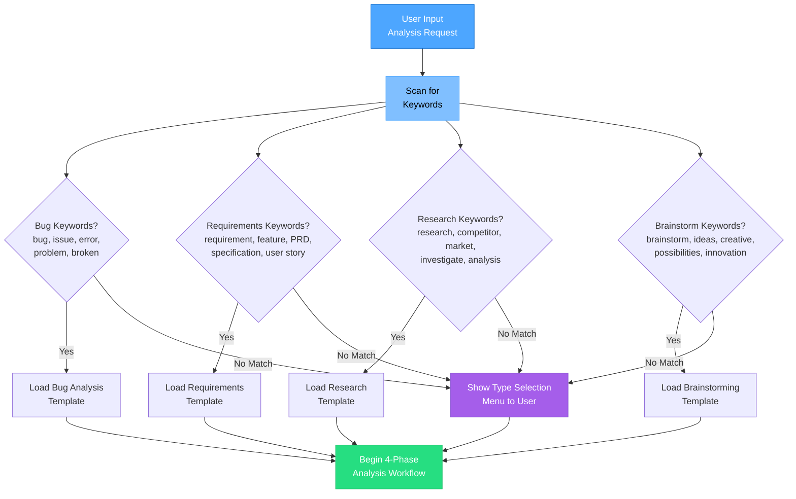
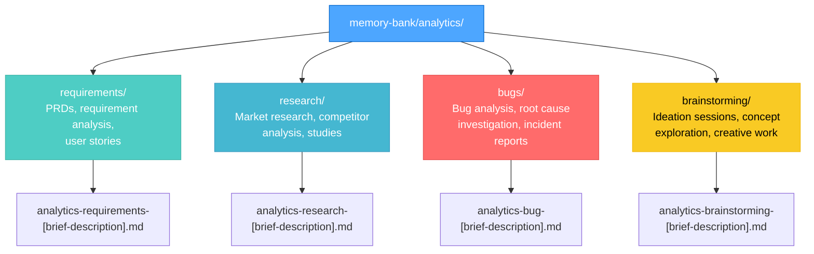
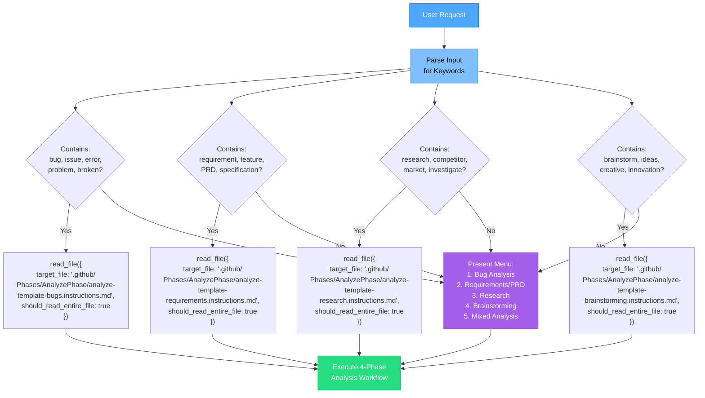

# ANALYZE MODE: PROBLEM ANALYSIS PROCESS MAP

> **TL;DR:** This visual map guides the ANALYZE mode process, focusing on structured problem analysis, research, and documentation before planning phase. Uses conditional template loading for token efficiency.

## 🧭 ANALYZE MODE PROCESS FLOW

```mermaid
graph TD
    Start["🚀 START ANALYZE MODE"] --> ReadTasks["📚 Read tasks.md &<br>.github/copilot-instructions.md"]
    
    %% Initialization
    ReadTasks --> DetectType["🔍 Detect Document Type<br>from User Input"]
    DetectType --> LoadTemplate["📋 Load Appropriate<br>Template Rule"]
    
    %% Document Type Detection
    DetectType --> TypeCheck{"📝 Document<br>Type?"}
    TypeCheck -->|"Bug Keywords"| BugAnalysis["🐛 BUG ANALYSIS<br>Load: analyze-template-bugs.instructions.md"]
    TypeCheck -->|"Requirements Keywords"| RequirementsAnalysis["📋 REQUIREMENTS/PRD<br>Load: analyze-template-requirements.instructions.md"]
    TypeCheck -->|"Research Keywords"| ResearchAnalysis["🔍 RESEARCH<br>Load: analyze-template-research.instructions.md"]
    TypeCheck -->|"Brainstorm Keywords"| BrainstormAnalysis["💡 BRAINSTORMING<br>Load: analyze-template-brainstorming.instructions.md"]
    TypeCheck -->|"Unclear"| ClarifyType["❓ Present Type Menu<br>to User"]
    
    %% 4-Phase Analysis Workflow
    BugAnalysis & RequirementsAnalysis & ResearchAnalysis & BrainstormAnalysis & ClarifyType --> Discover["🔍 DISCOVER PHASE<br>Research & Context Gathering"]
    
    Discover --> Analyze["📊 ANALYZE PHASE<br>Break Down & Investigate"]
    Analyze --> Synthesize["💡 SYNTHESIZE PHASE<br>Connect & Brainstorm Solutions"]
    Synthesize --> Document["📝 DOCUMENT PHASE<br>Create Analysis Documentation"]
    
    %% Analytics Folder Organization
    Document --> SaveAnalytics["💾 Save to Analytics Folder<br>memory-bank/analytics/[type]/"]
    SaveAnalytics --> UpdateMemoryBank["📝 Update Memory Bank Files<br>tasks.md, progress.md, activeContext.md"]
    
    %% Completion & Transition
    UpdateMemoryBank --> VerifyComplete["✅ Verify Analysis<br>Complete"]
    VerifyComplete --> UpdateTasks["📝 Update tasks.md<br>with Status"]
    UpdateTasks --> Transition["⏭️ NEXT MODE:<br>PLAN MODE"]
    
    %% Template Loading Details
    BugAnalysis -.-> BugTemplate["🐛 BUG ANALYSIS TEMPLATE:<br>- Problem Overview<br>- Reproduction Steps<br>- Root Cause Analysis<br>- Solution Options<br>- Prevention Measures"]
    
    RequirementsAnalysis -.-> ReqTemplate["📋 REQUIREMENTS TEMPLATE:<br>- Requirements Gathering<br>- Stakeholder Analysis<br>- Feature Breakdown<br>- PRD Structure<br>- Implementation Recommendations"]
    
    ResearchAnalysis -.-> ResearchTemplate["🔍 RESEARCH TEMPLATE:<br>- Research Questions<br>- Information Gathering<br>- Competitive Analysis<br>- Market Insights<br>- Strategic Recommendations"]
    
    BrainstormAnalysis -.-> BrainstormTemplate["💡 BRAINSTORMING TEMPLATE:<br>- Problem Definition<br>- Idea Generation<br>- Concept Evaluation<br>- Solution Prioritization<br>- Next Steps"]
    
    %% Validation Options
    Start -.-> Validation["🔍 VALIDATION OPTIONS:<br>- Show document type detection<br>- Demonstrate 4-phase workflow<br>- Create analysis documents<br>- Show analytics folder usage<br>- Generate mode transition"]
    
    %% Styling
    style Start fill:#4da6ff,stroke:#0066cc,color:white
    style ReadTasks fill:#80bfff,stroke:#4da6ff,color:black
    style DetectType fill:#80bfff,stroke:#4da6ff,color:black
    style TypeCheck fill:#d94dbb,stroke:#a3378a,color:white
    style BugAnalysis fill:#ff6b6b,stroke:#e55555,color:white
    style RequirementsAnalysis fill:#4ecdc4,stroke:#45b7aa,color:white
    style ResearchAnalysis fill:#45b7d1,stroke:#3a9bc1,color:white
    style BrainstormAnalysis fill:#f9ca24,stroke:#f0b90b,color:black
    style ClarifyType fill:#a55eea,stroke:#8854d0,color:white
    style Discover fill:#26de81,stroke:#20bf6b,color:white
    style Analyze fill:#fd79a8,stroke:#e84393,color:white
    style Synthesize fill:#fdcb6e,stroke:#e17055,color:black
    style Document fill:#6c5ce7,stroke:#5f3dc4,color:white
    style Transition fill:#00b894,stroke:#00a085,color:white
```



## 📋 DOCUMENT TYPE DETECTION WORKFLOW



## 🔄 4-PHASE ANALYSIS WORKFLOW

```mermaid
graph TD
    subgraph "Phase 1: DISCOVER 🔍"
        D1["Research & Context<br>Gathering"]
        D2["Stakeholder<br>Identification"]
        D3["Problem<br>Definition"]
        D4["Constraint<br>Analysis"]
    end
    
    subgraph "Phase 2: ANALYZE 📊"
        A1["Break Down<br>Components"]
        A2["Identify<br>Patterns"]
        A3["Root Cause<br>Investigation"]
        A4["Data<br>Analysis"]
    end
    
    subgraph "Phase 3: SYNTHESIZE 💡"
        S1["Connect<br>Insights"]
        S2["Generate<br>Solutions"]
        S3["Evaluate<br>Options"]
        S4["Prioritize<br>Recommendations"]
    end
    
    subgraph "Phase 4: DOCUMENT 📝"
        Doc1["Structure<br>Findings"]
        Doc2["Create Analysis<br>Document"]
        Doc3["Include Next<br>Steps"]
        Doc4["Save to Analytics<br>Folder"]
    end
    
    D1 --> D2 --> D3 --> D4
    D4 --> A1
    A1 --> A2 --> A3 --> A4
    A4 --> S1
    S1 --> S2 --> S3 --> S4
    S4 --> Doc1
    Doc1 --> Doc2 --> Doc3 --> Doc4
    
    style D1 fill:#26de81,stroke:#20bf6b,color:white
    style A1 fill:#fd79a8,stroke:#e84393,color:white
    style S1 fill:#fdcb6e,stroke:#e17055,color:black
    style Doc1 fill:#6c5ce7,stroke:#5f3dc4,color:white
```



## 📁 ANALYTICS FOLDER ORGANIZATION



## 📊 TEMPLATE LOADING DECISION TREE



## ✅ COMPLETION VERIFICATION WORKFLOW

```mermaid
graph TD
    Complete["Analysis<br>Complete"] --> Check1{"Analysis document<br>created in appropriate<br>analytics folder?"}
    
    Check1 -->|"No"| Fix1["Create analysis<br>document"]
    Check1 -->|"Yes"| Check2{"All 4 phases completed<br>(DISCOVER → ANALYZE →<br>SYNTHESIZE → DOCUMENT)?"}
    
    Check2 -->|"No"| Fix2["Complete missing<br>phases"]
    Check2 -->|"Yes"| Check3{"Clear next steps<br>identified for<br>PLAN mode?"}
    
    Check3 -->|"No"| Fix3["Define next steps<br>for planning"]
    Check3 -->|"Yes"| Check4{"Key insights<br>documented and<br>actionable?"}
    
    Check4 -->|"No"| Fix4["Enhance insights<br>documentation"]
    Check4 -->|"Yes"| Ready["✅ Ready for<br>PLAN Mode"]
    
    Fix1 --> Check1
    Fix2 --> Check2
    Fix3 --> Check3
    Fix4 --> Check4
    
    style Complete fill:#4dbbbb,stroke:#368787,color:white
    style Ready fill:#5fd94d,stroke:#3da336,color:white
    style Fix1 fill:#ff5555,stroke:#cc0000,color:white
    style Fix2 fill:#ff5555,stroke:#cc0000,color:white
    style Fix3 fill:#ff5555,stroke:#cc0000,color:white
    style Fix4 fill:#ff5555,stroke:#cc0000,color:white
```



## 🔄 MODE TRANSITION PROTOCOL

```mermaid
sequenceDiagram
    participant User
    participant ANALYZE
    participant MemoryBank
    participant PLAN
    
    User->>ANALYZE: Start analysis request
    ANALYZE->>ANALYZE: Detect document type
    ANALYZE->>ANALYZE: Load appropriate template
    ANALYZE->>ANALYZE: Execute 4-phase workflow
    ANALYZE->>MemoryBank: Save analysis document
    ANALYZE->>MemoryBank: Updatememory-bank/tasks.md
    ANALYZE->>User: "ANALYZE MODE COMPLETE ✅"
    ANALYZE->>User: "→ RECOMMENDED NEXT MODE: PLAN MODE"
    User->>PLAN: Start PLAN mode
    PLAN->>MemoryBank: Read analysis results
    PLAN->>User: "Continuing with analysis foundation..."
```



## 📋 ANALYZE MODE COMPLETION CHECKLIST

```
✓ ANALYZE MODE COMPLETION CHECKLIST
- Document type correctly identified? [YES/NO]
- Appropriate template loaded and followed? [YES/NO]
- All 4 phases completed (DISCOVER → ANALYZE → SYNTHESIZE → DOCUMENT)? [YES/NO]
- Analysis document saved to correct analytics subfolder? [YES/NO]
- File naming convention followed? [YES/NO]
- Clear next steps provided for PLAN mode? [YES/NO]
- Key insights documented and actionable? [YES/NO]
- Memory Bank files updated (tasks.md, progress.md, activeContext.md)? [YES/NO]

→ If all YES: Analysis complete - ready for PLAN mode
→ If any NO: Complete missing analysis elements
```

## 🔍 VALIDATION OPTIONS

When in ANALYZE mode, you can:

- **Show document type detection**: Demonstrate keyword matching process
- **Demonstrate 4-phase workflow**: Walk through DISCOVER → ANALYZE → SYNTHESIZE → DOCUMENT
- **Create analysis documents**: Generate sample analysis using templates
- **Show analytics folder usage**: Demonstrate folder organization and file naming
- **Generate mode transition**: Show handoff to PLAN mode with analysis results


